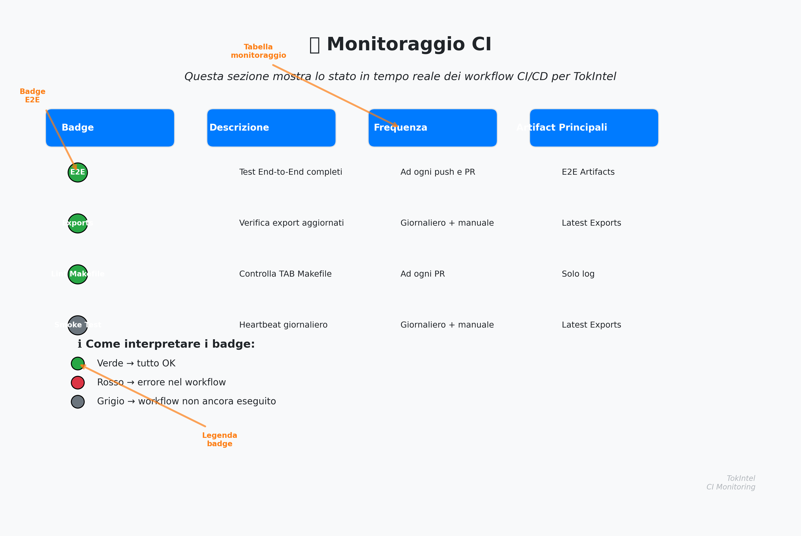

# TokIntel - Analisi Multimodale di Video

[](https://github.com/papemat/TokIntel/actions/workflows/ci.yml)
[](https://github.com/papemat/TokIntel/actions/workflows/sprint3-e2e.yml)
[](https://github.com/papemat/TokIntel/actions/workflows/export-health.yml)
[](https://github.com/papemat/TokIntel/actions/workflows/perf-nightly.yml)
[](https://papemat.github.io/TokIntel/main/index.html)
[](https://codecov.io/gh/papemat/TokIntel)
[](https://codecov.io/gh/papemat/TokIntel)
[](docs/GO_LIVE_CHECKLIST.md)
[](docs/ENTERPRISE_SETUP.md)
[](http://localhost:8502)
[](#)

TokIntel è un sistema di analisi multimodale per video che combina:
- **Estrazione audio** (Whisper)
- **Estrazione visiva** (OCR + CLIP)
- **Indicizzazione semantica** (FAISS)
- **Ricerca unificata** (testo + visivo)

## 📊 Monitoraggio CI

Questa sezione mostra lo stato in tempo reale dei workflow CI/CD per TokIntel e fornisce link diretti agli artifact prodotti.

| Badge | Descrizione | Frequenza | Artifact Principali |
|-------|-------------|-----------|---------------------|
| [](https://github.com/papemat/TokIntel/actions/workflows/sprint3-e2e.yml) | **Test End-to-End completi** su tutti i componenti | Ad ogni push e PR | [E2E Artifacts](https://github.com/papemat/TokIntel/actions/workflows/sprint3-e2e.yml) *(contiene screenshot, report HTML)* |
| [](https://github.com/papemat/TokIntel/actions/workflows/export-health.yml) | Verifica che gli export siano presenti e aggiornati nelle ultime 24h | Giornaliero + manuale | [Latest Exports](https://github.com/papemat/TokIntel/actions/workflows/export-health.yml) |
| [](https://github.com/papemat/TokIntel/actions/workflows/sprint3-e2e.yml) | Controlla che i comandi del Makefile usino TAB correttamente | Ad ogni PR | *(Nessun artifact — solo log)* |
| [](https://github.com/papemat/TokIntel/actions/workflows/smoke-test.yml) | Heartbeat giornaliero: esegue test rapidi, verifica export e salva log | Giornaliero + manuale | [Latest Exports](https://github.com/papemat/TokIntel/actions/workflows/smoke-test.yml) · [Streamlit Log](https://github.com/papemat/TokIntel/actions/workflows/smoke-test.yml) |

### ℹ️ Come interpretare i badge
- **Verde** → tutto OK
- **Rosso** → errore nel workflow → aprire il log per dettagli
- **Grigio** → workflow non ancora eseguito

## 🚀 Setup Rapido

```bash
# 1. Setup ambiente
make setup

# 2. Demo multimodale (genera frame finti, OCR, indice visivo)
make multimodal-demo

# 3. Rindicizza il testo (include OCR)
make index-cpu

# 4. Cerca (testuale + OCR)
make search q="CTA che converte"
```

## 🎯 Sprint 3 Quickstart

```bash
# UI con export automatico e porta fissa
TI_AUTO_EXPORT=1 TI_PORT=8510 make run-ui

# In un altro terminale, esegui i test
make test-sprint3

# Solo test E2E
make test-e2e-only

# CLI orchestrator
python -m analyzer.orchestrator --query "yoga breathing" --topk 5 --export exports/yoga_results
```

## Dev Smoke (locale)

```bash
# macOS/Linux
chmod +x scripts/kill_port.sh scripts/dev_smoke.sh
./scripts/dev_smoke.sh

# Windows PowerShell
./scripts/dev_smoke.ps1
```

### Esecuzione manuale workflow (debug)
- **Sprint 3 E2E**: Actions → *Sprint 3 E2E* → **Run workflow** → `debug=true` (stampa tail log E2E).
- **Unit & Lint (soft)**: Actions → *Unit & Lint (soft)* → **Run workflow** → `debug=true` (lint/unit verbose).

## Branch Protection consigliata
Per garantire stabilità del main:
1. Settings → Branches → main → Add rule:
   - ✅ Require pull request reviews
   - ✅ Require status checks to pass before merging
   - Seleziona: `Sprint 3 E2E` (bloccante)
   - Lascia `Unit & Lint (soft)` non bloccante
2. Opzionale: "Dismiss stale pull request approvals when new commits are pushed".

In questo modo:
- Solo l'E2E green è requisito per il merge
- I test unit legacy marcati `xfail` non bloccano il merge

## Sprint 4 Additions
- **E2E Playwright**: real UI interaction test (`make test-e2e-playwright` target optional)
- **dash/ unit tests**: +20% coverage goal on helpers
- **Export Health Report**: runs in CI to summarize exports (count, avg size, extensions)
- **Failure artifacts**: in caso di errore E2E Playwright, screenshot + HTML vengono salvati in `exports/screenshots/`.
- **E2E mode** (stabilizza l'export in test quando non ci sono risultati):
  ```bash
  TI_E2E_MODE=1 TI_AUTO_EXPORT=1 make test-e2e-playwright
  # oppure target dedicato:
  make ci-e2e-playwright
  ```
- **Install browsers** (prima del primo run Playwright):  
  ```bash
  make playwright-install
  ```

## 🏃‍♂️ Run Locally

```bash
# Setup ambiente virtuale
python -m venv .venv && source .venv/bin/activate  # Windows: .venv\Scripts\activate

# Installa dipendenze
pip install -r requirements.txt

# Opzionale: dipendenze aggiuntive (FAISS, etc.)
pip install -r requirements-optional.txt

# Avvia l'applicazione
python launch_tokintel_gui.py
```

## 📁 Struttura del Progetto

```
TokIntel/
├── config/
│   └── settings.yaml          # Configurazione multimodale
├── analyzer/
│   ├── frame_sampler.py       # Estrazione frame con ffmpeg
│   ├── ocr_extractor.py       # OCR con EasyOCR
│   ├── vision_clip.py         # Embedding CLIP
│   ├── build_visual_index.py  # Indice visivo FAISS
│   ├── index_faiss.py         # Indice testuale (include OCR)
│   └── run_multimodal.py      # Setup schema multimodale
├── downloader/
│   └── fetch_video.py         # Download video con yt-dlp
├── scripts/
│   ├── make_visual_demo.py    # Genera frame demo
│   └── run_multimodal_demo.sh # Demo completa
├── tests/
│   ├── test_ocr_and_frames.py # Test OCR
│   └── test_vision_clip.py    # Test CLIP
└── data/
    ├── frames/                # Frame estratti
    ├── ocr/                   # Risultati OCR
    ├── indexes/               # Indici FAISS
    └── media/video/           # Video scaricati
```

## 🔧 Configurazione

Modifica `config/settings.yaml` per personalizzare:

```yaml
visual:
  sampling_mode: "scene"     # "scene" | "fps"
  fps: 0.5                   # FPS per sampling fisso
  scene_threshold: 0.4       # Soglia rilevamento scene
  max_frames: 40             # Max frame per video

ocr:
  enabled: true
  langs: ["it","en"]         # Lingue OCR

vision:
  clip_model: "clip-ViT-B-32"
  batch_size: 32
  use_gpu_faiss: false       # GPU per FAISS
```

## 🎯 Comandi Principali

### Setup e Demo
```bash
make setup              # Virtual environment + dipendenze
make multimodal-demo    # Demo completa con frame finti
make test              # Test unitari
```

### Indici
```bash
make visual-index      # Indice visivo (CLIP)
make index-cpu         # Indice testuale (CPU)
make index-gpu         # Indice testuale (GPU)
```

### Pipeline Completa
```bash
# Per un video specifico
make download URL="https://tiktok.com/@user/video/123"
make pipeline URL="https://tiktok.com/@user/video/123"
```

### Utility
```bash
make clean             # Pulisce file generati
make help              # Mostra tutti i comandi
```

## 🎬 Funzionalità Multimodali

### 1. Estrazione Frame
- **Scene Detection**: Estrae frame quando cambia la scena
- **FPS Fisso**: Estrae frame a intervalli regolari
- **Resize Automatico**: Ridimensiona per ottimizzare CLIP

### 2. OCR (EasyOCR)
- **Multi-lingua**: Italiano + Inglese
- **Testo Combinato**: Unisce testo di tutti i frame
- **JSON Output**: Risultati strutturati

### 3. Embedding Visivi (CLIP)
- **CLIP ViT-B-32**: Modello bilanciato velocità/qualità
- **Pooling**: Media degli embedding dei frame
- **GPU/CPU**: Fallback automatico

### 4. Indici FAISS
- **Testuale**: Include OCR nel corpus di ricerca
- **Visivo**: Embedding CLIP per ricerca per similarità
- **Unificato**: Ricerca cross-modale

## 🔍 Ricerca

La ricerca ora include:
- **Testo trascritto** (Whisper)
- **Testo OCR** (EasyOCR)
- **Tag visivi** (CLIP)
- **Metadati** (titolo, hook, takeaways)

## Quality • Test & Coverage
[](https://papemat.github.io/TokIntel/main/index.html)
[](https://codecov.io/gh/papemat/TokIntel)
[](https://codecov.io/gh/papemat/TokIntel)

### Run tests with coverage
```bash
make test
```
Generates `coverage.xml` and terminal report.

### HTML report
```bash
make coverage-html
```
Opens `htmlcov/` with per-file details.

### Coverage Explorer (Streamlit)
```bash
make coverage-explorer
```
Mini dashboard per navigare la copertura (filtri, linee mancanti). Richiede `coverage.xml`. In CI, scarica l'artifact **coverage-html** (contiene anche `tools/coverage_explorer.py`).

### Export CSV/JSON dei file peggiori
```bash
make coverage-export
```
Genera:
- `coverage_summary_top.csv`: elenco ordinato (missed desc) dei file con più linee scoperte
- `coverage_summary_top.json`: stesso contenuto in JSON

### Coverage Action Plan (Markdown)
```bash
make coverage-todo
```
Genera:
- `coverage_todo.md`: checklist dei file peggiori con % e linee mancanti (artifact **coverage-todo** in CI).

### PR Coverage Preview (GitHub Pages)
Per ogni Pull Request viene pubblicata una preview HTML del coverage su **GitHub Pages**:
```
https://papemat.github.io/TokIntel/pr-<PR_NUMBER>/index.html
```
Il link compare automaticamente nel commento della PR.

## 📊 Performance

- **OCR**: ~2-5s per video (CPU)
- **CLIP**: ~10-30s per video (GPU: ~5-15s)
- **Indici**: ~1-5s per 100 video
- **Ricerca**: <100ms per query

## 🛠️ Dipendenze

- **Core**: FastAPI, SQLite, PyYAML
- **Audio**: OpenAI Whisper, ffmpeg
- **Visual**: OpenCV, EasyOCR, Pillow
- **AI/ML**: SentenceTransformers, PyTorch, FAISS
- **Utility**: requests, python-dotenv

## 🚨 Note

- **GPU**: Opzionale ma raccomandato per CLIP
- **FFmpeg**: Richiesto per estrazione frame
- **yt-dlp**: Per download video
- **Spazio**: ~100MB per video (frame + embedding)

## 🔄 Workflow Tipico

1. **Setup**: `make setup`
2. **Demo**: `make multimodal-demo`
3. **Video Reale**: `make download URL="..."`
4. **Analisi**: `make pipeline URL="..."`
5. **Ricerca**: Implementa interfaccia di ricerca

---

## 🖼️ Anteprima della sezione Monitoraggio CI



---

**TokIntel** - Analisi intelligente di contenuti video multimodali 🎬🔍
