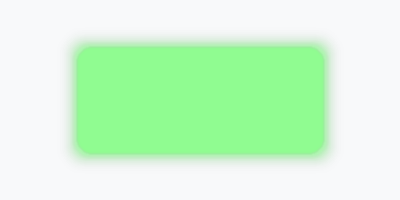
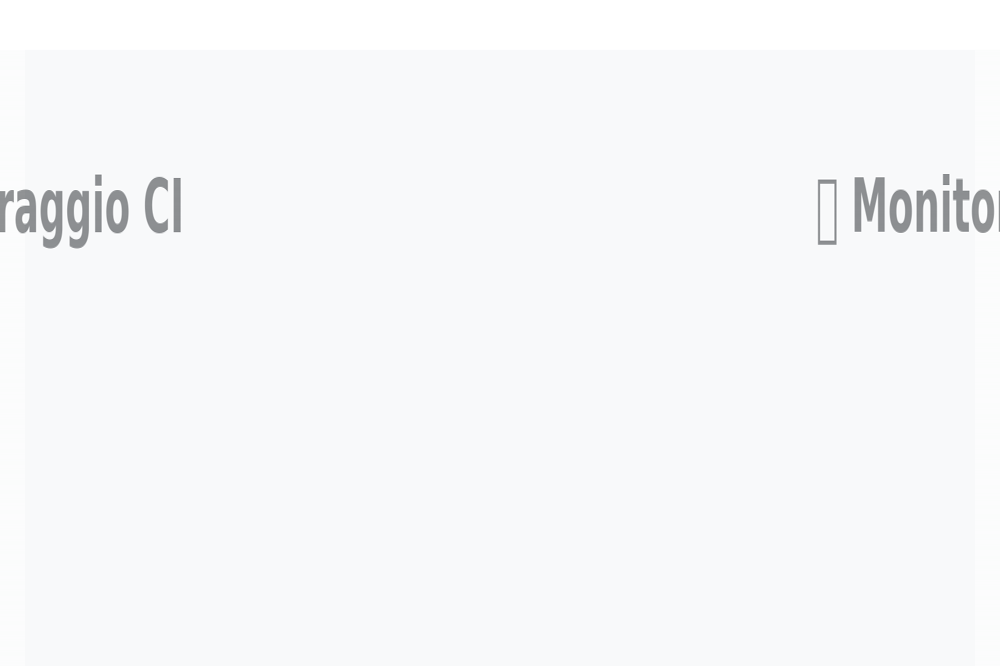

# TokIntel - Analisi Multimodale di Video

  
  

## 📈 Ultimi esiti monitor

> Stato automatico del workflow **Monitor CI/Visual** (cron + manuale).  
> Fonte: `docs/monitor_history.json` (aggiornato via GitHub Actions).

<!-- MONITOR_STATUS:START -->
_(in attesa del primo aggiornamento automatico)_
<!-- MONITOR_STATUS:END -->

TokIntel è un sistema di analisi multimodale per video che combina:
- **Estrazione audio** (Whisper)
- **Estrazione visiva** (OCR + CLIP)
- **Indicizzazione semantica** (FAISS)
- **Ricerca unificata** (testo + visivo)

## 📊 Monitoraggio CI

Questa sezione mostra lo stato in tempo reale dei workflow CI/CD per TokIntel e fornisce link diretti agli artifact prodotti.

| Badge | Descrizione | Frequenza | Artifact Principali |
|-------|-------------|-----------|---------------------|
|  | **Test End-to-End completi** su tutti i componenti | Ad ogni push e PR | [E2E Artifacts](https://github.com/papemat/TokIntel/actions/workflows/sprint3-e2e.yml) *(contiene screenshot, report HTML)* |
|  | Verifica che gli export siano presenti e aggiornati nelle ultime 24h | Giornaliero + manuale | [Latest Exports](https://github.com/papemat/TokIntel/actions/workflows/export-health.yml) |
|  | Controlla che i comandi del Makefile usino TAB correttamente | Ad ogni PR | *(Nessun artifact — solo log)* |
|  | Heartbeat giornaliero: esegue test rapidi, verifica export e salva log | Giornaliero + manuale | [Latest Exports](https://github.com/papemat/TokIntel/actions/workflows/smoke-test.yml) · [Streamlit Log](https://github.com/papemat/TokIntel/actions/workflows/smoke-test.yml) |

### ℹ️ Come interpretare i badge
- **Verde** → tutto OK
- **Rosso** → errore nel workflow → aprire il log per dettagli
- **Grigio** → workflow non ancora eseguito

### 🎥 Tutorial: Come usare i badge CI

> Questa GIF mostra come:
> 1. Cliccare sul badge di un workflow
> 2. Aprire il run più recente
> 3. Scaricare gli artifact generati

## ⚡ Quick Start – TokIntel GUI

> **🚀 Nuovo!** [Quickstart completo](README_QUICKSTART.md) con script launcher e troubleshooting

### Fast launch
- macOS/Linux: `./scripts/run_tokintel.sh`
- Windows: `scripts\run_tokintel.bat`

| Azione                  | Comando | Descrizione |
|-------------------------|---------|-------------|
| ▶️ **Avvio rapido**     | `make tokintel-gui-bg` | Avvia in background e apre il browser |
| 📡 **Monitoraggio log** | `make tokintel-gui-log` | Mostra log in tempo reale |
| 🩺 **Health check**     | `make tokintel-gui-health` | Verifica se la GUI è attiva (HTTP 200) |
| ⏹ **Stop pulito**       | `make tokintel-gui-stop` | Ferma il processo GUI in esecuzione |
| 🔄 **Riavvio**          | `make tokintel-gui-restart` | Stop + start in un solo comando |
| ⚙️ **Porta custom**     | `make tokintel-gui-on PORT=8502` | Avvia su una porta specifica |

  

| Azione                  | Comando | Descrizione |
|-------------------------|---------|-------------|
| ▶️ **Avvio rapido**     | `make tokintel-gui-bg` | Avvia in background e apre il browser |
| 📡 **Monitoraggio log** | `make tokintel-gui-log` | Mostra log in tempo reale |
| 🩺 **Health check**     | `make tokintel-gui-health` | Verifica se la GUI è attiva (HTTP 200) |
| ⏹ **Stop pulito**       | `make tokintel-gui-stop` | Ferma il processo GUI in esecuzione |
| 🔄 **Riavvio**          | `make tokintel-gui-restart` | Stop + start in un solo comando |
| ⚙️ **Porta custom**     | `make tokintel-gui-on PORT=8502` | Avvia su una porta specifica |

  

| Azione                  | Comando | Descrizione |
|-------------------------|---------|-------------|
| ▶️ **Avvio rapido**     | `make tokintel-gui-bg` | Avvia in background e apre il browser |
| 📡 **Monitoraggio log** | `make tokintel-gui-log` | Mostra log in tempo reale |
| 🩺 **Health check**     | `make tokintel-gui-health` | Verifica se la GUI è attiva (HTTP 200) |
| ⏹ **Stop pulito**       | `make tokintel-gui-stop` | Ferma il processo GUI in esecuzione |
| 🔄 **Riavvio**          | `make tokintel-gui-restart` | Stop + start in un solo comando |
| ⚙️ **Porta custom**     | `make tokintel-gui-on PORT=8502` | Avvia su una porta specifica |

  

| Azione                  | Comando | Descrizione |
|-------------------------|---------|-------------|
| ▶️ **Avvio rapido**     | `make tokintel-gui-bg` | Avvia in background e apre il browser |
| 📡 **Monitoraggio log** | `make tokintel-gui-log` | Mostra log in tempo reale |
| 🩺 **Health check**     | `make tokintel-gui-health` | Verifica se la GUI è attiva (HTTP 200) |
| ⏹ **Stop pulito**       | `make tokintel-gui-stop` | Ferma il processo GUI in esecuzione |
| 🔄 **Riavvio**          | `make tokintel-gui-restart` | Stop + start in un solo comando |
| ⚙️ **Porta custom**     | `make tokintel-gui-on PORT=8502` | Avvia su una porta specifica |

  

| Azione                  | Comando | Descrizione |
|-------------------------|---------|-------------|
| ▶️ **Avvio rapido**     | `make tokintel-gui-bg` | Avvia in background e apre il browser |
| 📡 **Monitoraggio log** | `make tokintel-gui-log` | Mostra log in tempo reale |
| 🩺 **Health check**     | `make tokintel-gui-health` | Verifica se la GUI è attiva (HTTP 200) |
| ⏹ **Stop pulito**       | `make tokintel-gui-stop` | Ferma il processo GUI in esecuzione |
| 🔄 **Riavvio**          | `make tokintel-gui-restart` | Stop + start in un solo comando |
| ⚙️ **Porta custom**     | `make tokintel-gui-on PORT=8502` | Avvia su una porta specifica |

  

| Azione                  | Comando | Descrizione |
|-------------------------|---------|-------------|
| ▶️ **Avvio rapido**     | `make tokintel-gui-bg` | Avvia in background e apre il browser |
| 📡 **Monitoraggio log** | `make tokintel-gui-log` | Mostra log in tempo reale |
| 🩺 **Health check**     | `make tokintel-gui-health` | Verifica se la GUI è attiva (HTTP 200) |
| ⏹ **Stop pulito**       | `make tokintel-gui-stop` | Ferma il processo GUI in esecuzione |
| 🔄 **Riavvio**          | `make tokintel-gui-restart` | Stop + start in un solo comando |
| ⚙️ **Porta custom**     | `make tokintel-gui-on PORT=8502` | Avvia su una porta specifica |

  

| Azione                  | Comando | Descrizione |
|-------------------------|---------|-------------|
| ▶️ **Avvio rapido**     | `make tokintel-gui-bg` | Avvia in background e apre il browser |
| 📡 **Monitoraggio log** | `make tokintel-gui-log` | Mostra log in tempo reale |
| 🩺 **Health check**     | `make tokintel-gui-health` | Verifica se la GUI è attiva (HTTP 200) |
| ⏹ **Stop pulito**       | `make tokintel-gui-stop` | Ferma il processo GUI in esecuzione |
| 🔄 **Riavvio**          | `make tokintel-gui-restart` | Stop + start in un solo comando |
| ⚙️ **Porta custom**     | `make tokintel-gui-on PORT=8502` | Avvia su una porta specifica |

  

| Azione                  | Comando | Descrizione |
|-------------------------|---------|-------------|
| ▶️ **Avvio rapido**     | `make tokintel-gui-bg` | Avvia in background e apre il browser |
| 📡 **Monitoraggio log** | `make tokintel-gui-log` | Mostra log in tempo reale |
| 🩺 **Health check**     | `make tokintel-gui-health` | Verifica se la GUI è attiva (HTTP 200) |
| ⏹ **Stop pulito**       | `make tokintel-gui-stop` | Ferma il processo GUI in esecuzione |
| 🔄 **Riavvio**          | `make tokintel-gui-restart` | Stop + start in un solo comando |
| ⚙️ **Porta custom**     | `make tokintel-gui-on PORT=8502` | Avvia su una porta specifica |

  

| Azione                  | Comando | Descrizione |
|-------------------------|---------|-------------|
| ▶️ **Avvio rapido**     | `make tokintel-gui-bg` | Avvia in background e apre il browser |
| 📡 **Monitoraggio log** | `make tokintel-gui-log` | Mostra log in tempo reale |
| 🩺 **Health check**     | `make tokintel-gui-health` | Verifica se la GUI è attiva (HTTP 200) |
| ⏹ **Stop pulito**       | `make tokintel-gui-stop` | Ferma il processo GUI in esecuzione |
| 🔄 **Riavvio**          | `make tokintel-gui-restart` | Stop + start in un solo comando |
| ⚙️ **Porta custom**     | `make tokintel-gui-on PORT=8502` | Avvia su una porta specifica |

  

| Azione                  | Comando | Descrizione |
|-------------------------|---------|-------------|
| ▶️ **Avvio rapido**     | `make tokintel-gui-bg` | Avvia in background e apre il browser |
| 📡 **Monitoraggio log** | `make tokintel-gui-log` | Mostra log in tempo reale |
| 🩺 **Health check**     | `make tokintel-gui-health` | Verifica se la GUI è attiva (HTTP 200) |
| ⏹ **Stop pulito**       | `make tokintel-gui-stop` | Ferma il processo GUI in esecuzione |
| 🔄 **Riavvio**          | `make tokintel-gui-restart` | Stop + start in un solo comando |
| ⚙️ **Porta custom**     | `make tokintel-gui-on PORT=8502` | Avvia su una porta specifica |

  

| Azione                  | Comando | Descrizione |
|-------------------------|---------|-------------|
| ▶️ **Avvio rapido**     | `make tokintel-gui-bg` | Avvia in background e apre il browser |
| 📡 **Monitoraggio log** | `make tokintel-gui-log` | Mostra log in tempo reale |
| 🩺 **Health check**     | `make tokintel-gui-health` | Verifica se la GUI è attiva (HTTP 200) |
| ⏹ **Stop pulito**       | `make tokintel-gui-stop` | Ferma il processo GUI in esecuzione |
| 🔄 **Riavvio**          | `make tokintel-gui-restart` | Stop + start in un solo comando |
| ⚙️ **Porta custom**     | `make tokintel-gui-on PORT=8502` | Avvia su una porta specifica |

  

| Azione                  | Comando | Descrizione |
|-------------------------|---------|-------------|
| ▶️ **Avvio rapido**     | `make tokintel-gui-bg` | Avvia in background e apre il browser |
| 📡 **Monitoraggio log** | `make tokintel-gui-log` | Mostra log in tempo reale |
| 🩺 **Health check**     | `make tokintel-gui-health` | Verifica se la GUI è attiva (HTTP 200) |
| ⏹ **Stop pulito**       | `make tokintel-gui-stop` | Ferma il processo GUI in esecuzione |
| 🔄 **Riavvio**          | `make tokintel-gui-restart` | Stop + start in un solo comando |
| ⚙️ **Porta custom**     | `make tokintel-gui-on PORT=8502` | Avvia su una porta specifica |

  

| Azione                  | Comando | Descrizione |
|-------------------------|---------|-------------|
| ▶️ **Avvio rapido**     | `make tokintel-gui-bg` | Avvia in background e apre il browser |
| 📡 **Monitoraggio log** | `make tokintel-gui-log` | Mostra log in tempo reale |
| 🩺 **Health check**     | `make tokintel-gui-health` | Verifica se la GUI è attiva (HTTP 200) |
| ⏹ **Stop pulito**       | `make tokintel-gui-stop` | Ferma il processo GUI in esecuzione |
| 🔄 **Riavvio**          | `make tokintel-gui-restart` | Stop + start in un solo comando |
| ⚙️ **Porta custom**     | `make tokintel-gui-on PORT=8502` | Avvia su una porta specifica |

  

| Azione                  | Comando | Descrizione |
|-------------------------|---------|-------------|
| ▶️ **Avvio rapido**     | `make tokintel-gui-bg` | Avvia in background e apre il browser |
| 📡 **Monitoraggio log** | `make tokintel-gui-log` | Mostra log in tempo reale |
| 🩺 **Health check**     | `make tokintel-gui-health` | Verifica se la GUI è attiva (HTTP 200) |
| ⏹ **Stop pulito**       | `make tokintel-gui-stop` | Ferma il processo GUI in esecuzione |
| 🔄 **Riavvio**          | `make tokintel-gui-restart` | Stop + start in un solo comando |
| ⚙️ **Porta custom**     | `make tokintel-gui-on PORT=8502` | Avvia su una porta specifica |

  

| Azione                  | Comando | Descrizione |
|-------------------------|---------|-------------|
| ▶️ **Avvio rapido**     | `make tokintel-gui-bg` | Avvia in background e apre il browser |
| 📡 **Monitoraggio log** | `make tokintel-gui-log` | Mostra log in tempo reale |
| 🩺 **Health check**     | `make tokintel-gui-health` | Verifica se la GUI è attiva (HTTP 200) |
| ⏹ **Stop pulito**       | `make tokintel-gui-stop` | Ferma il processo GUI in esecuzione |
| 🔄 **Riavvio**          | `make tokintel-gui-restart` | Stop + start in un solo comando |
| ⚙️ **Porta custom**     | `make tokintel-gui-on PORT=8502` | Avvia su una porta specifica |

  

| Azione                  | Comando | Descrizione |
|-------------------------|---------|-------------|
| ▶️ **Avvio rapido**     | `make tokintel-gui-bg` | Avvia in background e apre il browser |
| 📡 **Monitoraggio log** | `make tokintel-gui-log` | Mostra log in tempo reale |
| 🩺 **Health check**     | `make tokintel-gui-health` | Verifica se la GUI è attiva (HTTP 200) |
| ⏹ **Stop pulito**       | `make tokintel-gui-stop` | Ferma il processo GUI in esecuzione |
| 🔄 **Riavvio**          | `make tokintel-gui-restart` | Stop + start in un solo comando |
| ⚙️ **Porta custom**     | `make tokintel-gui-on PORT=8502` | Avvia su una porta specifica |

  

| Azione                  | Comando | Descrizione |
|-------------------------|---------|-------------|
| ▶️ **Avvio rapido**     | `make tokintel-gui-bg` | Avvia in background e apre il browser |
| 📡 **Monitoraggio log** | `make tokintel-gui-log` | Mostra log in tempo reale |
| 🩺 **Health check**     | `make tokintel-gui-health` | Verifica se la GUI è attiva (HTTP 200) |
| ⏹ **Stop pulito**       | `make tokintel-gui-stop` | Ferma il processo GUI in esecuzione |
| 🔄 **Riavvio**          | `make tokintel-gui-restart` | Stop + start in un solo comando |
| ⚙️ **Porta custom**     | `make tokintel-gui-on PORT=8502` | Avvia su una porta specifica |

  

| Azione                  | Comando | Descrizione |
|-------------------------|---------|-------------|
| ▶️ **Avvio rapido**     | `make tokintel-gui-bg` | Avvia in background e apre il browser |
| 📡 **Monitoraggio log** | `make tokintel-gui-log` | Mostra log in tempo reale |
| 🩺 **Health check**     | `make tokintel-gui-health` | Verifica se la GUI è attiva (HTTP 200) |
| ⏹ **Stop pulito**       | `make tokintel-gui-stop` | Ferma il processo GUI in esecuzione |
| 🔄 **Riavvio**          | `make tokintel-gui-restart` | Stop + start in un solo comando |
| ⚙️ **Porta custom**     | `make tokintel-gui-on PORT=8502` | Avvia su una porta specifica |

  

| Azione                  | Comando | Descrizione |
|-------------------------|---------|-------------|
| ▶️ **Avvio rapido**     | `make tokintel-gui-bg` | Avvia in background e apre il browser |
| 📡 **Monitoraggio log** | `make tokintel-gui-log` | Mostra log in tempo reale |
| 🩺 **Health check**     | `make tokintel-gui-health` | Verifica se la GUI è attiva (HTTP 200) |
| ⏹ **Stop pulito**       | `make tokintel-gui-stop` | Ferma il processo GUI in esecuzione |
| 🔄 **Riavvio**          | `make tokintel-gui-restart` | Stop + start in un solo comando |
| ⚙️ **Porta custom**     | `make tokintel-gui-on PORT=8502` | Avvia su una porta specifica |

  

| Azione                  | Comando | Descrizione |
|-------------------------|---------|-------------|
| ▶️ **Avvio rapido**     | `make tokintel-gui-bg` | Avvia in background e apre il browser |
| 📡 **Monitoraggio log** | `make tokintel-gui-log` | Mostra log in tempo reale |
| 🩺 **Health check**     | `make tokintel-gui-health` | Verifica se la GUI è attiva (HTTP 200) |
| ⏹ **Stop pulito**       | `make tokintel-gui-stop` | Ferma il processo GUI in esecuzione |
| 🔄 **Riavvio**          | `make tokintel-gui-restart` | Stop + start in un solo comando |
| ⚙️ **Porta custom**     | `make tokintel-gui-on PORT=8502` | Avvia su una porta specifica |

  

| Azione                  | Comando | Descrizione |
|-------------------------|---------|-------------|
| ▶️ **Avvio rapido**     | `make tokintel-gui-bg` | Avvia in background e apre il browser |
| 📡 **Monitoraggio log** | `make tokintel-gui-log` | Mostra log in tempo reale |
| 🩺 **Health check**     | `make tokintel-gui-health` | Verifica se la GUI è attiva (HTTP 200) |
| ⏹ **Stop pulito**       | `make tokintel-gui-stop` | Ferma il processo GUI in esecuzione |
| 🔄 **Riavvio**          | `make tokintel-gui-restart` | Stop + start in un solo comando |
| ⚙️ **Porta custom**     | `make tokintel-gui-on PORT=8502` | Avvia su una porta specifica |

  

| Azione                  | Comando | Descrizione |
|-------------------------|---------|-------------|
| ▶️ **Avvio rapido**     | `make tokintel-gui-bg` | Avvia in background e apre il browser |
| 📡 **Monitoraggio log** | `make tokintel-gui-log` | Mostra log in tempo reale |
| 🩺 **Health check**     | `make tokintel-gui-health` | Verifica se la GUI è attiva (HTTP 200) |
| ⏹ **Stop pulito**       | `make tokintel-gui-stop` | Ferma il processo GUI in esecuzione |
| 🔄 **Riavvio**          | `make tokintel-gui-restart` | Stop + start in un solo comando |
| ⚙️ **Porta custom**     | `make tokintel-gui-on PORT=8502` | Avvia su una porta specifica |

  

| Azione                  | Comando | Descrizione |
|-------------------------|---------|-------------|
| ▶️ **Avvio rapido**     | `make tokintel-gui-bg` | Avvia in background e apre il browser |
| 📡 **Monitoraggio log** | `make tokintel-gui-log` | Mostra log in tempo reale |
| 🩺 **Health check**     | `make tokintel-gui-health` | Verifica se la GUI è attiva (HTTP 200) |
| ⏹ **Stop pulito**       | `make tokintel-gui-stop` | Ferma il processo GUI in esecuzione |
| 🔄 **Riavvio**          | `make tokintel-gui-restart` | Stop + start in un solo comando |
| ⚙️ **Porta custom**     | `make tokintel-gui-on PORT=8502` | Avvia su una porta specifica |

  

| Azione                  | Comando | Descrizione |
|-------------------------|---------|-------------|
| ▶️ **Avvio rapido**     | `make tokintel-gui-bg` | Avvia in background e apre il browser |
| 📡 **Monitoraggio log** | `make tokintel-gui-log` | Mostra log in tempo reale |
| 🩺 **Health check**     | `make tokintel-gui-health` | Verifica se la GUI è attiva (HTTP 200) |
| ⏹ **Stop pulito**       | `make tokintel-gui-stop` | Ferma il processo GUI in esecuzione |
| 🔄 **Riavvio**          | `make tokintel-gui-restart` | Stop + start in un solo comando |
| ⚙️ **Porta custom**     | `make tokintel-gui-on PORT=8502` | Avvia su una porta specifica |

  

| Azione                  | Comando | Descrizione |
|-------------------------|---------|-------------|
| ▶️ **Avvio rapido**     | `make tokintel-gui-bg` | Avvia in background e apre il browser |
| 📡 **Monitoraggio log** | `make tokintel-gui-log` | Mostra log in tempo reale |
| 🩺 **Health check**     | `make tokintel-gui-health` | Verifica se la GUI è attiva (HTTP 200) |
| ⏹ **Stop pulito**       | `make tokintel-gui-stop` | Ferma il processo GUI in esecuzione |
| 🔄 **Riavvio**          | `make tokintel-gui-restart` | Stop + start in un solo comando |
| ⚙️ **Porta custom**     | `make tokintel-gui-on PORT=8502` | Avvia su una porta specifica |

  

| Azione                  | Comando | Descrizione |
|-------------------------|---------|-------------|
| ▶️ **Avvio rapido**     | `make tokintel-gui-bg` | Avvia in background e apre il browser |
| 📡 **Monitoraggio log** | `make tokintel-gui-log` | Mostra log in tempo reale |
| 🩺 **Health check**     | `make tokintel-gui-health` | Verifica se la GUI è attiva (HTTP 200) |
| ⏹ **Stop pulito**       | `make tokintel-gui-stop` | Ferma il processo GUI in esecuzione |
| 🔄 **Riavvio**          | `make tokintel-gui-restart` | Stop + start in un solo comando |
| ⚙️ **Porta custom**     | `make tokintel-gui-on PORT=8502` | Avvia su una porta specifica |

  

| Azione                  | Comando | Descrizione |
|-------------------------|---------|-------------|
| ▶️ **Avvio rapido**     | `make tokintel-gui-bg` | Avvia in background e apre il browser |
| 📡 **Monitoraggio log** | `make tokintel-gui-log` | Mostra log in tempo reale |
| 🩺 **Health check**     | `make tokintel-gui-health` | Verifica se la GUI è attiva (HTTP 200) |
| ⏹ **Stop pulito**       | `make tokintel-gui-stop` | Ferma il processo GUI in esecuzione |
| 🔄 **Riavvio**          | `make tokintel-gui-restart` | Stop + start in un solo comando |
| ⚙️ **Porta custom**     | `make tokintel-gui-on PORT=8502` | Avvia su una porta specifica |

  

| Azione                  | Comando | Descrizione |
|-------------------------|---------|-------------|
| ▶️ **Avvio rapido**     | `make tokintel-gui-bg` | Avvia in background e apre il browser |
| 📡 **Monitoraggio log** | `make tokintel-gui-log` | Mostra log in tempo reale |
| 🩺 **Health check**     | `make tokintel-gui-health` | Verifica se la GUI è attiva (HTTP 200) |
| ⏹ **Stop pulito**       | `make tokintel-gui-stop` | Ferma il processo GUI in esecuzione |
| 🔄 **Riavvio**          | `make tokintel-gui-restart` | Stop + start in un solo comando |
| ⚙️ **Porta custom**     | `make tokintel-gui-on PORT=8502` | Avvia su una porta specifica |

  

| Azione                  | Comando | Descrizione |
|-------------------------|---------|-------------|
| ▶️ **Avvio rapido**     | `make tokintel-gui-bg` | Avvia in background e apre il browser |
| 📡 **Monitoraggio log** | `make tokintel-gui-log` | Mostra log in tempo reale |
| 🩺 **Health check**     | `make tokintel-gui-health` | Verifica se la GUI è attiva (HTTP 200) |
| ⏹ **Stop pulito**       | `make tokintel-gui-stop` | Ferma il processo GUI in esecuzione |
| 🔄 **Riavvio**          | `make tokintel-gui-restart` | Stop + start in un solo comando |
| ⚙️ **Porta custom**     | `make tokintel-gui-on PORT=8502` | Avvia su una porta specifica |

  

| Azione                  | Comando | Descrizione |
|-------------------------|---------|-------------|
| ▶️ **Avvio rapido**     | `make tokintel-gui-bg` | Avvia in background e apre il browser |
| 📡 **Monitoraggio log** | `make tokintel-gui-log` | Mostra log in tempo reale |
| 🩺 **Health check**     | `make tokintel-gui-health` | Verifica se la GUI è attiva (HTTP 200) |
| ⏹ **Stop pulito**       | `make tokintel-gui-stop` | Ferma il processo GUI in esecuzione |
| 🔄 **Riavvio**          | `make tokintel-gui-restart` | Stop + start in un solo comando |
| ⚙️ **Porta custom**     | `make tokintel-gui-on PORT=8502` | Avvia su una porta specifica |

  

| Azione                  | Comando | Descrizione |
|-------------------------|---------|-------------|
| ▶️ **Avvio rapido**     | `make tokintel-gui-bg` | Avvia in background e apre il browser |
| 📡 **Monitoraggio log** | `make tokintel-gui-log` | Mostra log in tempo reale |
| 🩺 **Health check**     | `make tokintel-gui-health` | Verifica se la GUI è attiva (HTTP 200) |
| ⏹ **Stop pulito**       | `make tokintel-gui-stop` | Ferma il processo GUI in esecuzione |
| 🔄 **Riavvio**          | `make tokintel-gui-restart` | Stop + start in un solo comando |
| ⚙️ **Porta custom**     | `make tokintel-gui-on PORT=8502` | Avvia su una porta specifica |

  

| Azione                  | Comando | Descrizione |
|-------------------------|---------|-------------|
| ▶️ **Avvio rapido**     | `make tokintel-gui-bg` | Avvia in background e apre il browser |
| 📡 **Monitoraggio log** | `make tokintel-gui-log` | Mostra log in tempo reale |
| 🩺 **Health check**     | `make tokintel-gui-health` | Verifica se la GUI è attiva (HTTP 200) |
| ⏹ **Stop pulito**       | `make tokintel-gui-stop` | Ferma il processo GUI in esecuzione |
| 🔄 **Riavvio**          | `make tokintel-gui-restart` | Stop + start in un solo comando |
| ⚙️ **Porta custom**     | `make tokintel-gui-on PORT=8502` | Avvia su una porta specifica |

  

| Azione                  | Comando | Descrizione |
|-------------------------|---------|-------------|
| ▶️ **Avvio rapido**     | `make tokintel-gui-bg` | Avvia in background e apre il browser |
| 📡 **Monitoraggio log** | `make tokintel-gui-log` | Mostra log in tempo reale |
| 🩺 **Health check**     | `make tokintel-gui-health` | Verifica se la GUI è attiva (HTTP 200) |
| ⏹ **Stop pulito**       | `make tokintel-gui-stop` | Ferma il processo GUI in esecuzione |
| 🔄 **Riavvio**          | `make tokintel-gui-restart` | Stop + start in un solo comando |
| ⚙️ **Porta custom**     | `make tokintel-gui-on PORT=8502` | Avvia su una porta specifica |

  

| Azione                  | Comando | Descrizione |
|-------------------------|---------|-------------|
| ▶️ **Avvio rapido**     | `make tokintel-gui-bg` | Avvia in background e apre il browser |
| 📡 **Monitoraggio log** | `make tokintel-gui-log` | Mostra log in tempo reale |
| 🩺 **Health check**     | `make tokintel-gui-health` | Verifica se la GUI è attiva (HTTP 200) |
| ⏹ **Stop pulito**       | `make tokintel-gui-stop` | Ferma il processo GUI in esecuzione |
| 🔄 **Riavvio**          | `make tokintel-gui-restart` | Stop + start in un solo comando |
| ⚙️ **Porta custom**     | `make tokintel-gui-on PORT=8502` | Avvia su una porta specifica |

  

| Azione                  | Comando | Descrizione |
|-------------------------|---------|-------------|
| ▶️ **Avvio rapido**     | `make tokintel-gui-bg` | Avvia in background e apre il browser |
| 📡 **Monitoraggio log** | `make tokintel-gui-log` | Mostra log in tempo reale |
| 🩺 **Health check**     | `make tokintel-gui-health` | Verifica se la GUI è attiva (HTTP 200) |
| ⏹ **Stop pulito**       | `make tokintel-gui-stop` | Ferma il processo GUI in esecuzione |
| 🔄 **Riavvio**          | `make tokintel-gui-restart` | Stop + start in un solo comando |
| ⚙️ **Porta custom**     | `make tokintel-gui-on PORT=8502` | Avvia su una porta specifica |

  

| Azione                  | Comando | Descrizione |
|-------------------------|---------|-------------|
| ▶️ **Avvio rapido**     | `make tokintel-gui-bg` | Avvia in background e apre il browser |
| 📡 **Monitoraggio log** | `make tokintel-gui-log` | Mostra log in tempo reale |
| 🩺 **Health check**     | `make tokintel-gui-health` | Verifica se la GUI è attiva (HTTP 200) |
| ⏹ **Stop pulito**       | `make tokintel-gui-stop` | Ferma il processo GUI in esecuzione |
| 🔄 **Riavvio**          | `make tokintel-gui-restart` | Stop + start in un solo comando |
| ⚙️ **Porta custom**     | `make tokintel-gui-on PORT=8502` | Avvia su una porta specifica |

  

| Azione                  | Comando | Descrizione |
|-------------------------|---------|-------------|
| ▶️ **Avvio rapido**     | `make tokintel-gui-bg` | Avvia in background e apre il browser |
| 📡 **Monitoraggio log** | `make tokintel-gui-log` | Mostra log in tempo reale |
| 🩺 **Health check**     | `make tokintel-gui-health` | Verifica se la GUI è attiva (HTTP 200) |
| ⏹ **Stop pulito**       | `make tokintel-gui-stop` | Ferma il processo GUI in esecuzione |
| 🔄 **Riavvio**          | `make tokintel-gui-restart` | Stop + start in un solo comando |
| ⚙️ **Porta custom**     | `make tokintel-gui-on PORT=8502` | Avvia su una porta specifica |

  

| Azione                  | Comando | Descrizione |
|-------------------------|---------|-------------|
| ▶️ **Avvio rapido**     | `make tokintel-gui-bg` | Avvia in background e apre il browser |
| 📡 **Monitoraggio log** | `make tokintel-gui-log` | Mostra log in tempo reale |
| 🩺 **Health check**     | `make tokintel-gui-health` | Verifica se la GUI è attiva (HTTP 200) |
| ⏹ **Stop pulito**       | `make tokintel-gui-stop` | Ferma il processo GUI in esecuzione |
| 🔄 **Riavvio**          | `make tokintel-gui-restart` | Stop + start in un solo comando |
| ⚙️ **Porta custom**     | `make tokintel-gui-on PORT=8502` | Avvia su una porta specifica |

  

| Azione                  | Comando | Descrizione |
|-------------------------|---------|-------------|
| ▶️ **Avvio rapido**     | `make tokintel-gui-bg` | Avvia in background e apre il browser |
| 📡 **Monitoraggio log** | `make tokintel-gui-log` | Mostra log in tempo reale |
| 🩺 **Health check**     | `make tokintel-gui-health` | Verifica se la GUI è attiva (HTTP 200) |
| ⏹ **Stop pulito**       | `make tokintel-gui-stop` | Ferma il processo GUI in esecuzione |
| 🔄 **Riavvio**          | `make tokintel-gui-restart` | Stop + start in un solo comando |
| ⚙️ **Porta custom**     | `make tokintel-gui-on PORT=8502` | Avvia su una porta specifica |

  

| Azione                  | Comando | Descrizione |
|-------------------------|---------|-------------|
| ▶️ **Avvio rapido**     | `make tokintel-gui-bg` | Avvia in background e apre il browser |
| 📡 **Monitoraggio log** | `make tokintel-gui-log` | Mostra log in tempo reale |
| 🩺 **Health check**     | `make tokintel-gui-health` | Verifica se la GUI è attiva (HTTP 200) |
| ⏹ **Stop pulito**       | `make tokintel-gui-stop` | Ferma il processo GUI in esecuzione |
| 🔄 **Riavvio**          | `make tokintel-gui-restart` | Stop + start in un solo comando |
| ⚙️ **Porta custom**     | `make tokintel-gui-on PORT=8502` | Avvia su una porta specifica |

  

| Azione                  | Comando | Descrizione |
|-------------------------|---------|-------------|
| ▶️ **Avvio rapido**     | `make tokintel-gui-bg` | Avvia in background e apre il browser |
| 📡 **Monitoraggio log** | `make tokintel-gui-log` | Mostra log in tempo reale |
| 🩺 **Health check**     | `make tokintel-gui-health` | Verifica se la GUI è attiva (HTTP 200) |
| ⏹ **Stop pulito**       | `make tokintel-gui-stop` | Ferma il processo GUI in esecuzione |
| 🔄 **Riavvio**          | `make tokintel-gui-restart` | Stop + start in un solo comando |
| ⚙️ **Porta custom**     | `make tokintel-gui-on PORT=8502` | Avvia su una porta specifica |

  

| Azione                  | Comando | Descrizione |
|-------------------------|---------|-------------|
| ▶️ **Avvio rapido**     | `make tokintel-gui-bg` | Avvia in background e apre il browser |
| 📡 **Monitoraggio log** | `make tokintel-gui-log` | Mostra log in tempo reale |
| 🩺 **Health check**     | `make tokintel-gui-health` | Verifica se la GUI è attiva (HTTP 200) |
| ⏹ **Stop pulito**       | `make tokintel-gui-stop` | Ferma il processo GUI in esecuzione |
| 🔄 **Riavvio**          | `make tokintel-gui-restart` | Stop + start in un solo comando |
| ⚙️ **Porta custom**     | `make tokintel-gui-on PORT=8502` | Avvia su una porta specifica |

  

| Azione                  | Comando | Descrizione |
|-------------------------|---------|-------------|
| ▶️ **Avvio rapido**     | `make tokintel-gui-bg` | Avvia in background e apre il browser |
| 📡 **Monitoraggio log** | `make tokintel-gui-log` | Mostra log in tempo reale |
| 🩺 **Health check**     | `make tokintel-gui-health` | Verifica se la GUI è attiva (HTTP 200) |
| ⏹ **Stop pulito**       | `make tokintel-gui-stop` | Ferma il processo GUI in esecuzione |
| 🔄 **Riavvio**          | `make tokintel-gui-restart` | Stop + start in un solo comando |
| ⚙️ **Porta custom**     | `make tokintel-gui-on PORT=8502` | Avvia su una porta specifica |

  

| Azione                  | Comando | Descrizione |
|-------------------------|---------|-------------|
| ▶️ **Avvio rapido**     | `make tokintel-gui-bg` | Avvia in background e apre il browser |
| 📡 **Monitoraggio log** | `make tokintel-gui-log` | Mostra log in tempo reale |
| 🩺 **Health check**     | `make tokintel-gui-health` | Verifica se la GUI è attiva (HTTP 200) |
| ⏹ **Stop pulito**       | `make tokintel-gui-stop` | Ferma il processo GUI in esecuzione |
| 🔄 **Riavvio**          | `make tokintel-gui-restart` | Stop + start in un solo comando |
| ⚙️ **Porta custom**     | `make tokintel-gui-on PORT=8502` | Avvia su una porta specifica |

  

| Azione                  | Comando | Descrizione |
|-------------------------|---------|-------------|
| ▶️ **Avvio rapido**     | `make tokintel-gui-bg` | Avvia in background e apre il browser |
| 📡 **Monitoraggio log** | `make tokintel-gui-log` | Mostra log in tempo reale |
| 🩺 **Health check**     | `make tokintel-gui-health` | Verifica se la GUI è attiva (HTTP 200) |
| ⏹ **Stop pulito**       | `make tokintel-gui-stop` | Ferma il processo GUI in esecuzione |
| 🔄 **Riavvio**          | `make tokintel-gui-restart` | Stop + start in un solo comando |
| ⚙️ **Porta custom**     | `make tokintel-gui-on PORT=8502` | Avvia su una porta specifica |

  

| Azione                  | Comando | Descrizione |
|-------------------------|---------|-------------|
| ▶️ **Avvio rapido**     | `make tokintel-gui-bg` | Avvia in background e apre il browser |
| 📡 **Monitoraggio log** | `make tokintel-gui-log` | Mostra log in tempo reale |
| 🩺 **Health check**     | `make tokintel-gui-health` | Verifica se la GUI è attiva (HTTP 200) |
| ⏹ **Stop pulito**       | `make tokintel-gui-stop` | Ferma il processo GUI in esecuzione |
| 🔄 **Riavvio**          | `make tokintel-gui-restart` | Stop + start in un solo comando |
| ⚙️ **Porta custom**     | `make tokintel-gui-on PORT=8502` | Avvia su una porta specifica |

  

| Azione                  | Comando | Descrizione |
|-------------------------|---------|-------------|
| ▶️ **Avvio rapido**     | `make tokintel-gui-bg` | Avvia in background e apre il browser |
| 📡 **Monitoraggio log** | `make tokintel-gui-log` | Mostra log in tempo reale |
| 🩺 **Health check**     | `make tokintel-gui-health` | Verifica se la GUI è attiva (HTTP 200) |
| ⏹ **Stop pulito**       | `make tokintel-gui-stop` | Ferma il processo GUI in esecuzione |
| 🔄 **Riavvio**          | `make tokintel-gui-restart` | Stop + start in un solo comando |
| ⚙️ **Porta custom**     | `make tokintel-gui-on PORT=8502` | Avvia su una porta specifica |

  

| Azione                  | Comando | Descrizione |
|-------------------------|---------|-------------|
| ▶️ **Avvio rapido**     | `make tokintel-gui-bg` | Avvia in background e apre il browser |
| 📡 **Monitoraggio log** | `make tokintel-gui-log` | Mostra log in tempo reale |
| 🩺 **Health check**     | `make tokintel-gui-health` | Verifica se la GUI è attiva (HTTP 200) |
| ⏹ **Stop pulito**       | `make tokintel-gui-stop` | Ferma il processo GUI in esecuzione |
| 🔄 **Riavvio**          | `make tokintel-gui-restart` | Stop + start in un solo comando |
| ⚙️ **Porta custom**     | `make tokintel-gui-on PORT=8502` | Avvia su una porta specifica |

  

| Azione                  | Comando | Descrizione |
|-------------------------|---------|-------------|
| ▶️ **Avvio rapido**     | `make tokintel-gui-bg` | Avvia in background e apre il browser |
| 📡 **Monitoraggio log** | `make tokintel-gui-log` | Mostra log in tempo reale |
| 🩺 **Health check**     | `make tokintel-gui-health` | Verifica se la GUI è attiva (HTTP 200) |
| ⏹ **Stop pulito**       | `make tokintel-gui-stop` | Ferma il processo GUI in esecuzione |
| 🔄 **Riavvio**          | `make tokintel-gui-restart` | Stop + start in un solo comando |
| ⚙️ **Porta custom**     | `make tokintel-gui-on PORT=8502` | Avvia su una porta specifica |

  

| Azione                  | Comando | Descrizione |
|-------------------------|---------|-------------|
| ▶️ **Avvio rapido**     | `make tokintel-gui-bg` | Avvia in background e apre il browser |
| 📡 **Monitoraggio log** | `make tokintel-gui-log` | Mostra log in tempo reale |
| 🩺 **Health check**     | `make tokintel-gui-health` | Verifica se la GUI è attiva (HTTP 200) |
| ⏹ **Stop pulito**       | `make tokintel-gui-stop` | Ferma il processo GUI in esecuzione |
| 🔄 **Riavvio**          | `make tokintel-gui-restart` | Stop + start in un solo comando |
| ⚙️ **Porta custom**     | `make tokintel-gui-on PORT=8502` | Avvia su una porta specifica |

  

| Azione                  | Comando | Descrizione |
|-------------------------|---------|-------------|
| ▶️ **Avvio rapido**     | `make tokintel-gui-bg` | Avvia in background e apre il browser |
| 📡 **Monitoraggio log** | `make tokintel-gui-log` | Mostra log in tempo reale |
| 🩺 **Health check**     | `make tokintel-gui-health` | Verifica se la GUI è attiva (HTTP 200) |
| ⏹ **Stop pulito**       | `make tokintel-gui-stop` | Ferma il processo GUI in esecuzione |
| 🔄 **Riavvio**          | `make tokintel-gui-restart` | Stop + start in un solo comando |
| ⚙️ **Porta custom**     | `make tokintel-gui-on PORT=8502` | Avvia su una porta specifica |

  

| Azione                  | Comando | Descrizione |
|-------------------------|---------|-------------|
| ▶️ **Avvio rapido**     | `make tokintel-gui-bg` | Avvia in background e apre il browser |
| 📡 **Monitoraggio log** | `make tokintel-gui-log` | Mostra log in tempo reale |
| 🩺 **Health check**     | `make tokintel-gui-health` | Verifica se la GUI è attiva (HTTP 200) |
| ⏹ **Stop pulito**       | `make tokintel-gui-stop` | Ferma il processo GUI in esecuzione |
| 🔄 **Riavvio**          | `make tokintel-gui-restart` | Stop + start in un solo comando |
| ⚙️ **Porta custom**     | `make tokintel-gui-on PORT=8502` | Avvia su una porta specifica |

  

| Azione                  | Comando | Descrizione |
|-------------------------|---------|-------------|
| ▶️ **Avvio rapido**     | `make tokintel-gui-bg` | Avvia in background e apre il browser |
| 📡 **Monitoraggio log** | `make tokintel-gui-log` | Mostra log in tempo reale |
| 🩺 **Health check**     | `make tokintel-gui-health` | Verifica se la GUI è attiva (HTTP 200) |
| ⏹ **Stop pulito**       | `make tokintel-gui-stop` | Ferma il processo GUI in esecuzione |
| 🔄 **Riavvio**          | `make tokintel-gui-restart` | Stop + start in un solo comando |
| ⚙️ **Porta custom**     | `make tokintel-gui-on PORT=8502` | Avvia su una porta specifica |

  

| Azione                  | Comando | Descrizione |
|-------------------------|---------|-------------|
| ▶️ **Avvio rapido**     | `make tokintel-gui-bg` | Avvia in background e apre il browser |
| 📡 **Monitoraggio log** | `make tokintel-gui-log` | Mostra log in tempo reale |
| 🩺 **Health check**     | `make tokintel-gui-health` | Verifica se la GUI è attiva (HTTP 200) |
| ⏹ **Stop pulito**       | `make tokintel-gui-stop` | Ferma il processo GUI in esecuzione |
| 🔄 **Riavvio**          | `make tokintel-gui-restart` | Stop + start in un solo comando |
| ⚙️ **Porta custom**     | `make tokintel-gui-on PORT=8502` | Avvia su una porta specifica |

  

| Azione                  | Comando | Descrizione |
|-------------------------|---------|-------------|
| ▶️ **Avvio rapido**     | `make tokintel-gui-bg` | Avvia in background e apre il browser |
| 📡 **Monitoraggio log** | `make tokintel-gui-log` | Mostra log in tempo reale |
| 🩺 **Health check**     | `make tokintel-gui-health` | Verifica se la GUI è attiva (HTTP 200) |
| ⏹ **Stop pulito**       | `make tokintel-gui-stop` | Ferma il processo GUI in esecuzione |
| 🔄 **Riavvio**          | `make tokintel-gui-restart` | Stop + start in un solo comando |
| ⚙️ **Porta custom**     | `make tokintel-gui-on PORT=8502` | Avvia su una porta specifica |

  

| Azione                  | Comando | Descrizione |
|-------------------------|---------|-------------|
| ▶️ **Avvio rapido**     | `make tokintel-gui-bg` | Avvia in background e apre il browser |
| 📡 **Monitoraggio log** | `make tokintel-gui-log` | Mostra log in tempo reale |
| 🩺 **Health check**     | `make tokintel-gui-health` | Verifica se la GUI è attiva (HTTP 200) |
| ⏹ **Stop pulito**       | `make tokintel-gui-stop` | Ferma il processo GUI in esecuzione |
| 🔄 **Riavvio**          | `make tokintel-gui-restart` | Stop + start in un solo comando |
| ⚙️ **Porta custom**     | `make tokintel-gui-on PORT=8502` | Avvia su una porta specifica |

  

| Azione                  | Comando | Descrizione |
|-------------------------|---------|-------------|
| ▶️ **Avvio rapido**     | `make tokintel-gui-bg` | Avvia in background e apre il browser |
| 📡 **Monitoraggio log** | `make tokintel-gui-log` | Mostra log in tempo reale |
| 🩺 **Health check**     | `make tokintel-gui-health` | Verifica se la GUI è attiva (HTTP 200) |
| ⏹ **Stop pulito**       | `make tokintel-gui-stop` | Ferma il processo GUI in esecuzione |
| 🔄 **Riavvio**          | `make tokintel-gui-restart` | Stop + start in un solo comando |
| ⚙️ **Porta custom**     | `make tokintel-gui-on PORT=8502` | Avvia su una porta specifica |

  

| Azione                  | Comando | Descrizione |
|-------------------------|---------|-------------|
| ▶️ **Avvio rapido**     | `make tokintel-gui-bg` | Avvia in background e apre il browser |
| 📡 **Monitoraggio log** | `make tokintel-gui-log` | Mostra log in tempo reale |
| 🩺 **Health check**     | `make tokintel-gui-health` | Verifica se la GUI è attiva (HTTP 200) |
| ⏹ **Stop pulito**       | `make tokintel-gui-stop` | Ferma il processo GUI in esecuzione |
| 🔄 **Riavvio**          | `make tokintel-gui-restart` | Stop + start in un solo comando |
| ⚙️ **Porta custom**     | `make tokintel-gui-on PORT=8502` | Avvia su una porta specifica |

  

| Azione                  | Comando | Descrizione |
|-------------------------|---------|-------------|
| ▶️ **Avvio rapido**     | `make tokintel-gui-bg` | Avvia in background e apre il browser |
| 📡 **Monitoraggio log** | `make tokintel-gui-log` | Mostra log in tempo reale |
| 🩺 **Health check**     | `make tokintel-gui-health` | Verifica se la GUI è attiva (HTTP 200) |
| ⏹ **Stop pulito**       | `make tokintel-gui-stop` | Ferma il processo GUI in esecuzione |
| 🔄 **Riavvio**          | `make tokintel-gui-restart` | Stop + start in un solo comando |
| ⚙️ **Porta custom**     | `make tokintel-gui-on PORT=8502` | Avvia su una porta specifica |

  

| Azione                  | Comando | Descrizione |
|-------------------------|---------|-------------|
| ▶️ **Avvio rapido**     | `make tokintel-gui-bg` | Avvia in background e apre il browser |
| 📡 **Monitoraggio log** | `make tokintel-gui-log` | Mostra log in tempo reale |
| 🩺 **Health check**     | `make tokintel-gui-health` | Verifica se la GUI è attiva (HTTP 200) |
| ⏹ **Stop pulito**       | `make tokintel-gui-stop` | Ferma il processo GUI in esecuzione |
| 🔄 **Riavvio**          | `make tokintel-gui-restart` | Stop + start in un solo comando |
| ⚙️ **Porta custom**     | `make tokintel-gui-on PORT=8502` | Avvia su una porta specifica |

  

| Azione                  | Comando | Descrizione |
|-------------------------|---------|-------------|
| ▶️ **Avvio rapido**     | `make tokintel-gui-bg` | Avvia in background e apre il browser |
| 📡 **Monitoraggio log** | `make tokintel-gui-log` | Mostra log in tempo reale |
| 🩺 **Health check**     | `make tokintel-gui-health` | Verifica se la GUI è attiva (HTTP 200) |
| ⏹ **Stop pulito**       | `make tokintel-gui-stop` | Ferma il processo GUI in esecuzione |
| 🔄 **Riavvio**          | `make tokintel-gui-restart` | Stop + start in un solo comando |
| ⚙️ **Porta custom**     | `make tokintel-gui-on PORT=8502` | Avvia su una porta specifica |

  

| Azione                  | Comando | Descrizione |
|-------------------------|---------|-------------|
| ▶️ **Avvio rapido**     | `make tokintel-gui-bg` | Avvia in background e apre il browser |
| 📡 **Monitoraggio log** | `make tokintel-gui-log` | Mostra log in tempo reale |
| 🩺 **Health check**     | `make tokintel-gui-health` | Verifica se la GUI è attiva (HTTP 200) |
| ⏹ **Stop pulito**       | `make tokintel-gui-stop` | Ferma il processo GUI in esecuzione |
| 🔄 **Riavvio**          | `make tokintel-gui-restart` | Stop + start in un solo comando |
| ⚙️ **Porta custom**     | `make tokintel-gui-on PORT=8502` | Avvia su una porta specifica |

  

| Azione                  | Comando | Descrizione |
|-------------------------|---------|-------------|
| ▶️ **Avvio rapido**     | `make tokintel-gui-bg` | Avvia in background e apre il browser |
| 📡 **Monitoraggio log** | `make tokintel-gui-log` | Mostra log in tempo reale |
| 🩺 **Health check**     | `make tokintel-gui-health` | Verifica se la GUI è attiva (HTTP 200) |
| ⏹ **Stop pulito**       | `make tokintel-gui-stop` | Ferma il processo GUI in esecuzione |
| 🔄 **Riavvio**          | `make tokintel-gui-restart` | Stop + start in un solo comando |
| ⚙️ **Porta custom**     | `make tokintel-gui-on PORT=8502` | Avvia su una porta specifica |

  

| Azione                  | Comando | Descrizione |
|-------------------------|---------|-------------|
| ▶️ **Avvio rapido**     | `make tokintel-gui-bg` | Avvia in background e apre il browser |
| 📡 **Monitoraggio log** | `make tokintel-gui-log` | Mostra log in tempo reale |
| 🩺 **Health check**     | `make tokintel-gui-health` | Verifica se la GUI è attiva (HTTP 200) |
| ⏹ **Stop pulito**       | `make tokintel-gui-stop` | Ferma il processo GUI in esecuzione |
| 🔄 **Riavvio**          | `make tokintel-gui-restart` | Stop + start in un solo comando |
| ⚙️ **Porta custom**     | `make tokintel-gui-on PORT=8502` | Avvia su una porta specifica |

  

| Azione                  | Comando | Descrizione |
|-------------------------|---------|-------------|
| ▶️ **Avvio rapido**     | `make tokintel-gui-bg` | Avvia in background e apre il browser |
| 📡 **Monitoraggio log** | `make tokintel-gui-log` | Mostra log in tempo reale |
| 🩺 **Health check**     | `make tokintel-gui-health` | Verifica se la GUI è attiva (HTTP 200) |
| ⏹ **Stop pulito**       | `make tokintel-gui-stop` | Ferma il processo GUI in esecuzione |
| 🔄 **Riavvio**          | `make tokintel-gui-restart` | Stop + start in un solo comando |
| ⚙️ **Porta custom**     | `make tokintel-gui-on PORT=8502` | Avvia su una porta specifica |

  

| Azione                  | Comando | Descrizione |
|-------------------------|---------|-------------|
| ▶️ **Avvio rapido**     | `make tokintel-gui-bg` | Avvia in background e apre il browser |
| 📡 **Monitoraggio log** | `make tokintel-gui-log` | Mostra log in tempo reale |
| 🩺 **Health check**     | `make tokintel-gui-health` | Verifica se la GUI è attiva (HTTP 200) |
| ⏹ **Stop pulito**       | `make tokintel-gui-stop` | Ferma il processo GUI in esecuzione |
| 🔄 **Riavvio**          | `make tokintel-gui-restart` | Stop + start in un solo comando |
| ⚙️ **Porta custom**     | `make tokintel-gui-on PORT=8502` | Avvia su una porta specifica |

  

| Azione                  | Comando | Descrizione |
|-------------------------|---------|-------------|
| ▶️ **Avvio rapido**     | `make tokintel-gui-bg` | Avvia in background e apre il browser |
| 📡 **Monitoraggio log** | `make tokintel-gui-log` | Mostra log in tempo reale |
| 🩺 **Health check**     | `make tokintel-gui-health` | Verifica se la GUI è attiva (HTTP 200) |
| ⏹ **Stop pulito**       | `make tokintel-gui-stop` | Ferma il processo GUI in esecuzione |
| 🔄 **Riavvio**          | `make tokintel-gui-restart` | Stop + start in un solo comando |
| ⚙️ **Porta custom**     | `make tokintel-gui-on PORT=8502` | Avvia su una porta specifica |

  

| Azione                  | Comando | Descrizione |
|-------------------------|---------|-------------|
| ▶️ **Avvio rapido**     | `make tokintel-gui-bg` | Avvia in background e apre il browser |
| 📡 **Monitoraggio log** | `make tokintel-gui-log` | Mostra log in tempo reale |
| 🩺 **Health check**     | `make tokintel-gui-health` | Verifica se la GUI è attiva (HTTP 200) |
| ⏹ **Stop pulito**       | `make tokintel-gui-stop` | Ferma il processo GUI in esecuzione |
| 🔄 **Riavvio**          | `make tokintel-gui-restart` | Stop + start in un solo comando |
| ⚙️ **Porta custom**     | `make tokintel-gui-on PORT=8502` | Avvia su una porta specifica |

  

| Azione                  | Comando | Descrizione |
|-------------------------|---------|-------------|
| ▶️ **Avvio rapido**     | `make tokintel-gui-bg` | Avvia in background e apre il browser |
| 📡 **Monitoraggio log** | `make tokintel-gui-log` | Mostra log in tempo reale |
| 🩺 **Health check**     | `make tokintel-gui-health` | Verifica se la GUI è attiva (HTTP 200) |
| ⏹ **Stop pulito**       | `make tokintel-gui-stop` | Ferma il processo GUI in esecuzione |
| 🔄 **Riavvio**          | `make tokintel-gui-restart` | Stop + start in un solo comando |
| ⚙️ **Porta custom**     | `make tokintel-gui-on PORT=8502` | Avvia su una porta specifica |

  

| Azione                  | Comando | Descrizione |
|-------------------------|---------|-------------|
| ▶️ **Avvio rapido**     | `make tokintel-gui-bg` | Avvia in background e apre il browser |
| 📡 **Monitoraggio log** | `make tokintel-gui-log` | Mostra log in tempo reale |
| 🩺 **Health check**     | `make tokintel-gui-health` | Verifica se la GUI è attiva (HTTP 200) |
| ⏹ **Stop pulito**       | `make tokintel-gui-stop` | Ferma il processo GUI in esecuzione |
| 🔄 **Riavvio**          | `make tokintel-gui-restart` | Stop + start in un solo comando |
| ⚙️ **Porta custom**     | `make tokintel-gui-on PORT=8502` | Avvia su una porta specifica |

  

| Azione                  | Comando | Descrizione |
|-------------------------|---------|-------------|
| ▶️ **Avvio rapido**     | `make tokintel-gui-bg` | Avvia in background e apre il browser |
| 📡 **Monitoraggio log** | `make tokintel-gui-log` | Mostra log in tempo reale |
| 🩺 **Health check**     | `make tokintel-gui-health` | Verifica se la GUI è attiva (HTTP 200) |
| ⏹ **Stop pulito**       | `make tokintel-gui-stop` | Ferma il processo GUI in esecuzione |
| 🔄 **Riavvio**          | `make tokintel-gui-restart` | Stop + start in un solo comando |
| ⚙️ **Porta custom**     | `make tokintel-gui-on PORT=8502` | Avvia su una porta specifica |

  

| Azione                  | Comando | Descrizione |
|-------------------------|---------|-------------|
| ▶️ **Avvio rapido**     | `make tokintel-gui-bg` | Avvia in background e apre il browser |
| 📡 **Monitoraggio log** | `make tokintel-gui-log` | Mostra log in tempo reale |
| 🩺 **Health check**     | `make tokintel-gui-health` | Verifica se la GUI è attiva (HTTP 200) |
| ⏹ **Stop pulito**       | `make tokintel-gui-stop` | Ferma il processo GUI in esecuzione |
| 🔄 **Riavvio**          | `make tokintel-gui-restart` | Stop + start in un solo comando |
| ⚙️ **Porta custom**     | `make tokintel-gui-on PORT=8502` | Avvia su una porta specifica |

  

| Azione                  | Comando | Descrizione |
|-------------------------|---------|-------------|
| ▶️ **Avvio rapido**     | `make tokintel-gui-bg` | Avvia in background e apre il browser |
| 📡 **Monitoraggio log** | `make tokintel-gui-log` | Mostra log in tempo reale |
| 🩺 **Health check**     | `make tokintel-gui-health` | Verifica se la GUI è attiva (HTTP 200) |
| ⏹ **Stop pulito**       | `make tokintel-gui-stop` | Ferma il processo GUI in esecuzione |
| 🔄 **Riavvio**          | `make tokintel-gui-restart` | Stop + start in un solo comando |
| ⚙️ **Porta custom**     | `make tokintel-gui-on PORT=8502` | Avvia su una porta specifica |

  

| Azione                  | Comando | Descrizione |
|-------------------------|---------|-------------|
| ▶️ **Avvio rapido**     | `make tokintel-gui-bg` | Avvia in background e apre il browser |
| 📡 **Monitoraggio log** | `make tokintel-gui-log` | Mostra log in tempo reale |
| 🩺 **Health check**     | `make tokintel-gui-health` | Verifica se la GUI è attiva (HTTP 200) |
| ⏹ **Stop pulito**       | `make tokintel-gui-stop` | Ferma il processo GUI in esecuzione |
| 🔄 **Riavvio**          | `make tokintel-gui-restart` | Stop + start in un solo comando |
| ⚙️ **Porta custom**     | `make tokintel-gui-on PORT=8502` | Avvia su una porta specifica |

  

| Azione                  | Comando | Descrizione |
|-------------------------|---------|-------------|
| ▶️ **Avvio rapido**     | `make tokintel-gui-bg` | Avvia in background e apre il browser |
| 📡 **Monitoraggio log** | `make tokintel-gui-log` | Mostra log in tempo reale |
| 🩺 **Health check**     | `make tokintel-gui-health` | Verifica se la GUI è attiva (HTTP 200) |
| ⏹ **Stop pulito**       | `make tokintel-gui-stop` | Ferma il processo GUI in esecuzione |
| 🔄 **Riavvio**          | `make tokintel-gui-restart` | Stop + start in un solo comando |
| ⚙️ **Porta custom**     | `make tokintel-gui-on PORT=8502` | Avvia su una porta specifica |

  

| Azione                  | Comando | Descrizione |
|-------------------------|---------|-------------|
| ▶️ **Avvio rapido**     | `make tokintel-gui-bg` | Avvia in background e apre il browser |
| 📡 **Monitoraggio log** | `make tokintel-gui-log` | Mostra log in tempo reale |
| 🩺 **Health check**     | `make tokintel-gui-health` | Verifica se la GUI è attiva (HTTP 200) |
| ⏹ **Stop pulito**       | `make tokintel-gui-stop` | Ferma il processo GUI in esecuzione |
| 🔄 **Riavvio**          | `make tokintel-gui-restart` | Stop + start in un solo comando |
| ⚙️ **Porta custom**     | `make tokintel-gui-on PORT=8502` | Avvia su una porta specifica |

  

| Azione                  | Comando | Descrizione |
|-------------------------|---------|-------------|
| ▶️ **Avvio rapido**     | `make tokintel-gui-bg` | Avvia in background e apre il browser |
| 📡 **Monitoraggio log** | `make tokintel-gui-log` | Mostra log in tempo reale |
| 🩺 **Health check**     | `make tokintel-gui-health` | Verifica se la GUI è attiva (HTTP 200) |
| ⏹ **Stop pulito**       | `make tokintel-gui-stop` | Ferma il processo GUI in esecuzione |
| 🔄 **Riavvio**          | `make tokintel-gui-restart` | Stop + start in un solo comando |
| ⚙️ **Porta custom**     | `make tokintel-gui-on PORT=8502` | Avvia su una porta specifica |

  

| Azione                  | Comando | Descrizione |
|-------------------------|---------|-------------|
| ▶️ **Avvio rapido**     | `make tokintel-gui-bg` | Avvia in background e apre il browser |
| 📡 **Monitoraggio log** | `make tokintel-gui-log` | Mostra log in tempo reale |
| 🩺 **Health check**     | `make tokintel-gui-health` | Verifica se la GUI è attiva (HTTP 200) |
| ⏹ **Stop pulito**       | `make tokintel-gui-stop` | Ferma il processo GUI in esecuzione |
| 🔄 **Riavvio**          | `make tokintel-gui-restart` | Stop + start in un solo comando |
| ⚙️ **Porta custom**     | `make tokintel-gui-on PORT=8502` | Avvia su una porta specifica |

  

| Azione                  | Comando | Descrizione |
|-------------------------|---------|-------------|
| ▶️ **Avvio rapido**     | `make tokintel-gui-bg` | Avvia in background e apre il browser |
| 📡 **Monitoraggio log** | `make tokintel-gui-log` | Mostra log in tempo reale |
| 🩺 **Health check**     | `make tokintel-gui-health` | Verifica se la GUI è attiva (HTTP 200) |
| ⏹ **Stop pulito**       | `make tokintel-gui-stop` | Ferma il processo GUI in esecuzione |
| 🔄 **Riavvio**          | `make tokintel-gui-restart` | Stop + start in un solo comando |
| ⚙️ **Porta custom**     | `make tokintel-gui-on PORT=8502` | Avvia su una porta specifica |

  

| Azione                  | Comando | Descrizione |
|-------------------------|---------|-------------|
| ▶️ **Avvio rapido**     | `make tokintel-gui-bg` | Avvia in background e apre il browser |
| 📡 **Monitoraggio log** | `make tokintel-gui-log` | Mostra log in tempo reale |
| 🩺 **Health check**     | `make tokintel-gui-health` | Verifica se la GUI è attiva (HTTP 200) |
| ⏹ **Stop pulito**       | `make tokintel-gui-stop` | Ferma il processo GUI in esecuzione |
| 🔄 **Riavvio**          | `make tokintel-gui-restart` | Stop + start in un solo comando |
| ⚙️ **Porta custom**     | `make tokintel-gui-on PORT=8502` | Avvia su una porta specifica |

  

| Azione                  | Comando | Descrizione |
|-------------------------|---------|-------------|
| ▶️ **Avvio rapido**     | `make tokintel-gui-bg` | Avvia in background e apre il browser |
| 📡 **Monitoraggio log** | `make tokintel-gui-log` | Mostra log in tempo reale |
| 🩺 **Health check**     | `make tokintel-gui-health` | Verifica se la GUI è attiva (HTTP 200) |
| ⏹ **Stop pulito**       | `make tokintel-gui-stop` | Ferma il processo GUI in esecuzione |
| 🔄 **Riavvio**          | `make tokintel-gui-restart` | Stop + start in un solo comando |
| ⚙️ **Porta custom**     | `make tokintel-gui-on PORT=8502` | Avvia su una porta specifica |

  

| Azione                  | Comando | Descrizione |
|-------------------------|---------|-------------|
| ▶️ **Avvio rapido**     | `make tokintel-gui-bg` | Avvia in background e apre il browser |
| 📡 **Monitoraggio log** | `make tokintel-gui-log` | Mostra log in tempo reale |
| 🩺 **Health check**     | `make tokintel-gui-health` | Verifica se la GUI è attiva (HTTP 200) |
| ⏹ **Stop pulito**       | `make tokintel-gui-stop` | Ferma il processo GUI in esecuzione |
| 🔄 **Riavvio**          | `make tokintel-gui-restart` | Stop + start in un solo comando |
| ⚙️ **Porta custom**     | `make tokintel-gui-on PORT=8502` | Avvia su una porta specifica |

  

| Azione                  | Comando | Descrizione |
|-------------------------|---------|-------------|
| ▶️ **Avvio rapido**     | `make tokintel-gui-bg` | Avvia in background e apre il browser |
| 📡 **Monitoraggio log** | `make tokintel-gui-log` | Mostra log in tempo reale |
| 🩺 **Health check**     | `make tokintel-gui-health` | Verifica se la GUI è attiva (HTTP 200) |
| ⏹ **Stop pulito**       | `make tokintel-gui-stop` | Ferma il processo GUI in esecuzione |
| 🔄 **Riavvio**          | `make tokintel-gui-restart` | Stop + start in un solo comando |
| ⚙️ **Porta custom**     | `make tokintel-gui-on PORT=8502` | Avvia su una porta specifica |

  

| Azione                  | Comando | Descrizione |
|-------------------------|---------|-------------|
| ▶️ **Avvio rapido**     | `make tokintel-gui-bg` | Avvia in background e apre il browser |
| 📡 **Monitoraggio log** | `make tokintel-gui-log` | Mostra log in tempo reale |
| 🩺 **Health check**     | `make tokintel-gui-health` | Verifica se la GUI è attiva (HTTP 200) |
| ⏹ **Stop pulito**       | `make tokintel-gui-stop` | Ferma il processo GUI in esecuzione |
| 🔄 **Riavvio**          | `make tokintel-gui-restart` | Stop + start in un solo comando |
| ⚙️ **Porta custom**     | `make tokintel-gui-on PORT=8502` | Avvia su una porta specifica |

  

| Azione                  | Comando | Descrizione |
|-------------------------|---------|-------------|
| ▶️ **Avvio rapido**     | `make tokintel-gui-bg` | Avvia in background e apre il browser |
| 📡 **Monitoraggio log** | `make tokintel-gui-log` | Mostra log in tempo reale |
| 🩺 **Health check**     | `make tokintel-gui-health` | Verifica se la GUI è attiva (HTTP 200) |
| ⏹ **Stop pulito**       | `make tokintel-gui-stop` | Ferma il processo GUI in esecuzione |
| 🔄 **Riavvio**          | `make tokintel-gui-restart` | Stop + start in un solo comando |
| ⚙️ **Porta custom**     | `make tokintel-gui-on PORT=8502` | Avvia su una porta specifica |

  

| Azione                  | Comando | Descrizione |
|-------------------------|---------|-------------|
| ▶️ **Avvio rapido**     | `make tokintel-gui-bg` | Avvia in background e apre il browser |
| 📡 **Monitoraggio log** | `make tokintel-gui-log` | Mostra log in tempo reale |
| 🩺 **Health check**     | `make tokintel-gui-health` | Verifica se la GUI è attiva (HTTP 200) |
| ⏹ **Stop pulito**       | `make tokintel-gui-stop` | Ferma il processo GUI in esecuzione |
| 🔄 **Riavvio**          | `make tokintel-gui-restart` | Stop + start in un solo comando |
| ⚙️ **Porta custom**     | `make tokintel-gui-on PORT=8502` | Avvia su una porta specifica |

  

| Azione                  | Comando | Descrizione |
|-------------------------|---------|-------------|
| ▶️ **Avvio rapido**     | `make tokintel-gui-bg` | Avvia in background e apre il browser |
| 📡 **Monitoraggio log** | `make tokintel-gui-log` | Mostra log in tempo reale |
| 🩺 **Health check**     | `make tokintel-gui-health` | Verifica se la GUI è attiva (HTTP 200) |
| ⏹ **Stop pulito**       | `make tokintel-gui-stop` | Ferma il processo GUI in esecuzione |
| 🔄 **Riavvio**          | `make tokintel-gui-restart` | Stop + start in un solo comando |
| ⚙️ **Porta custom**     | `make tokintel-gui-on PORT=8502` | Avvia su una porta specifica |

  

| Azione                  | Comando | Descrizione |
|-------------------------|---------|-------------|
| ▶️ **Avvio rapido**     | `make tokintel-gui-bg` | Avvia in background e apre il browser |
| 📡 **Monitoraggio log** | `make tokintel-gui-log` | Mostra log in tempo reale |
| 🩺 **Health check**     | `make tokintel-gui-health` | Verifica se la GUI è attiva (HTTP 200) |
| ⏹ **Stop pulito**       | `make tokintel-gui-stop` | Ferma il processo GUI in esecuzione |
| 🔄 **Riavvio**          | `make tokintel-gui-restart` | Stop + start in un solo comando |
| ⚙️ **Porta custom**     | `make tokintel-gui-on PORT=8502` | Avvia su una porta specifica |

  

| Azione                  | Comando | Descrizione |
|-------------------------|---------|-------------|
| ▶️ **Avvio rapido**     | `make tokintel-gui-bg` | Avvia in background e apre il browser |
| 📡 **Monitoraggio log** | `make tokintel-gui-log` | Mostra log in tempo reale |
| 🩺 **Health check**     | `make tokintel-gui-health` | Verifica se la GUI è attiva (HTTP 200) |
| ⏹ **Stop pulito**       | `make tokintel-gui-stop` | Ferma il processo GUI in esecuzione |
| 🔄 **Riavvio**          | `make tokintel-gui-restart` | Stop + start in un solo comando |
| ⚙️ **Porta custom**     | `make tokintel-gui-on PORT=8502` | Avvia su una porta specifica |

  

| Azione                  | Comando | Descrizione |
|-------------------------|---------|-------------|
| ▶️ **Avvio rapido**     | `make tokintel-gui-bg` | Avvia in background e apre il browser |
| 📡 **Monitoraggio log** | `make tokintel-gui-log` | Mostra log in tempo reale |
| 🩺 **Health check**     | `make tokintel-gui-health` | Verifica se la GUI è attiva (HTTP 200) |
| ⏹ **Stop pulito**       | `make tokintel-gui-stop` | Ferma il processo GUI in esecuzione |
| 🔄 **Riavvio**          | `make tokintel-gui-restart` | Stop + start in un solo comando |
| ⚙️ **Porta custom**     | `make tokintel-gui-on PORT=8502` | Avvia su una porta specifica |

  

| Azione                  | Comando | Descrizione |
|-------------------------|---------|-------------|
| ▶️ **Avvio rapido**     | `make tokintel-gui-bg` | Avvia in background e apre il browser |
| 📡 **Monitoraggio log** | `make tokintel-gui-log` | Mostra log in tempo reale |
| 🩺 **Health check**     | `make tokintel-gui-health` | Verifica se la GUI è attiva (HTTP 200) |
| ⏹ **Stop pulito**       | `make tokintel-gui-stop` | Ferma il processo GUI in esecuzione |
| 🔄 **Riavvio**          | `make tokintel-gui-restart` | Stop + start in un solo comando |
| ⚙️ **Porta custom**     | `make tokintel-gui-on PORT=8502` | Avvia su una porta specifica |

  

| Azione                  | Comando | Descrizione |
|-------------------------|---------|-------------|
| ▶️ **Avvio rapido**     | `make tokintel-gui-bg` | Avvia in background e apre il browser |
| 📡 **Monitoraggio log** | `make tokintel-gui-log` | Mostra log in tempo reale |
| 🩺 **Health check**     | `make tokintel-gui-health` | Verifica se la GUI è attiva (HTTP 200) |
| ⏹ **Stop pulito**       | `make tokintel-gui-stop` | Ferma il processo GUI in esecuzione |
| 🔄 **Riavvio**          | `make tokintel-gui-restart` | Stop + start in un solo comando |
| ⚙️ **Porta custom**     | `make tokintel-gui-on PORT=8502` | Avvia su una porta specifica |

  

| Azione                  | Comando | Descrizione |
|-------------------------|---------|-------------|
| ▶️ **Avvio rapido**     | `make tokintel-gui-bg` | Avvia in background e apre il browser |
| 📡 **Monitoraggio log** | `make tokintel-gui-log` | Mostra log in tempo reale |
| 🩺 **Health check**     | `make tokintel-gui-health` | Verifica se la GUI è attiva (HTTP 200) |
| ⏹ **Stop pulito**       | `make tokintel-gui-stop` | Ferma il processo GUI in esecuzione |
| 🔄 **Riavvio**          | `make tokintel-gui-restart` | Stop + start in un solo comando |
| ⚙️ **Porta custom**     | `make tokintel-gui-on PORT=8502` | Avvia su una porta specifica |

  

| Azione                  | Comando | Descrizione |
|-------------------------|---------|-------------|
| ▶️ **Avvio rapido**     | `make tokintel-gui-bg` | Avvia in background e apre il browser |
| 📡 **Monitoraggio log** | `make tokintel-gui-log` | Mostra log in tempo reale |
| 🩺 **Health check**     | `make tokintel-gui-health` | Verifica se la GUI è attiva (HTTP 200) |
| ⏹ **Stop pulito**       | `make tokintel-gui-stop` | Ferma il processo GUI in esecuzione |
| 🔄 **Riavvio**          | `make tokintel-gui-restart` | Stop + start in un solo comando |
| ⚙️ **Porta custom**     | `make tokintel-gui-on PORT=8502` | Avvia su una porta specifica |

  

| Azione                  | Comando | Descrizione |
|-------------------------|---------|-------------|
| ▶️ **Avvio rapido**     | `make tokintel-gui-bg` | Avvia in background e apre il browser |
| 📡 **Monitoraggio log** | `make tokintel-gui-log` | Mostra log in tempo reale |
| 🩺 **Health check**     | `make tokintel-gui-health` | Verifica se la GUI è attiva (HTTP 200) |
| ⏹ **Stop pulito**       | `make tokintel-gui-stop` | Ferma il processo GUI in esecuzione |
| 🔄 **Riavvio**          | `make tokintel-gui-restart` | Stop + start in un solo comando |
| ⚙️ **Porta custom**     | `make tokintel-gui-on PORT=8502` | Avvia su una porta specifica |

  

| Azione                  | Comando | Descrizione |
|-------------------------|---------|-------------|
| ▶️ **Avvio rapido**     | `make tokintel-gui-bg` | Avvia in background e apre il browser |
| 📡 **Monitoraggio log** | `make tokintel-gui-log` | Mostra log in tempo reale |
| 🩺 **Health check**     | `make tokintel-gui-health` | Verifica se la GUI è attiva (HTTP 200) |
| ⏹ **Stop pulito**       | `make tokintel-gui-stop` | Ferma il processo GUI in esecuzione |
| 🔄 **Riavvio**          | `make tokintel-gui-restart` | Stop + start in un solo comando |
| ⚙️ **Porta custom**     | `make tokintel-gui-on PORT=8502` | Avvia su una porta specifica |

  

| Azione                  | Comando | Descrizione |
|-------------------------|---------|-------------|
| ▶️ **Avvio rapido**     | `make tokintel-gui-bg` | Avvia in background e apre il browser |
| 📡 **Monitoraggio log** | `make tokintel-gui-log` | Mostra log in tempo reale |
| 🩺 **Health check**     | `make tokintel-gui-health` | Verifica se la GUI è attiva (HTTP 200) |
| ⏹ **Stop pulito**       | `make tokintel-gui-stop` | Ferma il processo GUI in esecuzione |
| 🔄 **Riavvio**          | `make tokintel-gui-restart` | Stop + start in un solo comando |
| ⚙️ **Porta custom**     | `make tokintel-gui-on PORT=8502` | Avvia su una porta specifica |

  

| Azione                  | Comando | Descrizione |
|-------------------------|---------|-------------|
| ▶️ **Avvio rapido**     | `make tokintel-gui-bg` | Avvia in background e apre il browser |
| 📡 **Monitoraggio log** | `make tokintel-gui-log` | Mostra log in tempo reale |
| 🩺 **Health check**     | `make tokintel-gui-health` | Verifica se la GUI è attiva (HTTP 200) |
| ⏹ **Stop pulito**       | `make tokintel-gui-stop` | Ferma il processo GUI in esecuzione |
| 🔄 **Riavvio**          | `make tokintel-gui-restart` | Stop + start in un solo comando |
| ⚙️ **Porta custom**     | `make tokintel-gui-on PORT=8502` | Avvia su una porta specifica |

  

| Azione                  | Comando | Descrizione |
|-------------------------|---------|-------------|
| ▶️ **Avvio rapido**     | `make tokintel-gui-bg` | Avvia in background e apre il browser |
| 📡 **Monitoraggio log** | `make tokintel-gui-log` | Mostra log in tempo reale |
| 🩺 **Health check**     | `make tokintel-gui-health` | Verifica se la GUI è attiva (HTTP 200) |
| ⏹ **Stop pulito**       | `make tokintel-gui-stop` | Ferma il processo GUI in esecuzione |
| 🔄 **Riavvio**          | `make tokintel-gui-restart` | Stop + start in un solo comando |
| ⚙️ **Porta custom**     | `make tokintel-gui-on PORT=8502` | Avvia su una porta specifica |

  

| Azione                  | Comando | Descrizione |
|-------------------------|---------|-------------|
| ▶️ **Avvio rapido**     | `make tokintel-gui-bg` | Avvia in background e apre il browser |
| 📡 **Monitoraggio log** | `make tokintel-gui-log` | Mostra log in tempo reale |
| 🩺 **Health check**     | `make tokintel-gui-health` | Verifica se la GUI è attiva (HTTP 200) |
| ⏹ **Stop pulito**       | `make tokintel-gui-stop` | Ferma il processo GUI in esecuzione |
| 🔄 **Riavvio**          | `make tokintel-gui-restart` | Stop + start in un solo comando |
| ⚙️ **Porta custom**     | `make tokintel-gui-on PORT=8502` | Avvia su una porta specifica |

  

| Azione                  | Comando | Descrizione |
|-------------------------|---------|-------------|
| ▶️ **Avvio rapido**     | `make tokintel-gui-bg` | Avvia in background e apre il browser |
| 📡 **Monitoraggio log** | `make tokintel-gui-log` | Mostra log in tempo reale |
| 🩺 **Health check**     | `make tokintel-gui-health` | Verifica se la GUI è attiva (HTTP 200) |
| ⏹ **Stop pulito**       | `make tokintel-gui-stop` | Ferma il processo GUI in esecuzione |
| 🔄 **Riavvio**          | `make tokintel-gui-restart` | Stop + start in un solo comando |
| ⚙️ **Porta custom**     | `make tokintel-gui-on PORT=8502` | Avvia su una porta specifica |

  

| Azione                  | Comando | Descrizione |
|-------------------------|---------|-------------|
| ▶️ **Avvio rapido**     | `make tokintel-gui-bg` | Avvia in background e apre il browser |
| 📡 **Monitoraggio log** | `make tokintel-gui-log` | Mostra log in tempo reale |
| 🩺 **Health check**     | `make tokintel-gui-health` | Verifica se la GUI è attiva (HTTP 200) |
| ⏹ **Stop pulito**       | `make tokintel-gui-stop` | Ferma il processo GUI in esecuzione |
| 🔄 **Riavvio**          | `make tokintel-gui-restart` | Stop + start in un solo comando |
| ⚙️ **Porta custom**     | `make tokintel-gui-on PORT=8502` | Avvia su una porta specifica |

  

| Azione                  | Comando | Descrizione |
|-------------------------|---------|-------------|
| ▶️ **Avvio rapido**     | `make tokintel-gui-bg` | Avvia in background e apre il browser |
| 📡 **Monitoraggio log** | `make tokintel-gui-log` | Mostra log in tempo reale |
| 🩺 **Health check**     | `make tokintel-gui-health` | Verifica se la GUI è attiva (HTTP 200) |
| ⏹ **Stop pulito**       | `make tokintel-gui-stop` | Ferma il processo GUI in esecuzione |
| 🔄 **Riavvio**          | `make tokintel-gui-restart` | Stop + start in un solo comando |
| ⚙️ **Porta custom**     | `make tokintel-gui-on PORT=8502` | Avvia su una porta specifica |

  

| Azione                  | Comando | Descrizione |
|-------------------------|---------|-------------|
| ▶️ **Avvio rapido**     | `make tokintel-gui-bg` | Avvia in background e apre il browser |
| 📡 **Monitoraggio log** | `make tokintel-gui-log` | Mostra log in tempo reale |
| 🩺 **Health check**     | `make tokintel-gui-health` | Verifica se la GUI è attiva (HTTP 200) |
| ⏹ **Stop pulito**       | `make tokintel-gui-stop` | Ferma il processo GUI in esecuzione |
| 🔄 **Riavvio**          | `make tokintel-gui-restart` | Stop + start in un solo comando |
| ⚙️ **Porta custom**     | `make tokintel-gui-on PORT=8502` | Avvia su una porta specifica |

  

| Azione                  | Comando | Descrizione |
|-------------------------|---------|-------------|
| ▶️ **Avvio rapido**     | `make tokintel-gui-bg` | Avvia in background e apre il browser |
| 📡 **Monitoraggio log** | `make tokintel-gui-log` | Mostra log in tempo reale |
| 🩺 **Health check**     | `make tokintel-gui-health` | Verifica se la GUI è attiva (HTTP 200) |
| ⏹ **Stop pulito**       | `make tokintel-gui-stop` | Ferma il processo GUI in esecuzione |
| 🔄 **Riavvio**          | `make tokintel-gui-restart` | Stop + start in un solo comando |
| ⚙️ **Porta custom**     | `make tokintel-gui-on PORT=8502` | Avvia su una porta specifica |

  

| Azione                  | Comando | Descrizione |
|-------------------------|---------|-------------|
| ▶️ **Avvio rapido**     | `make tokintel-gui-bg` | Avvia in background e apre il browser |
| 📡 **Monitoraggio log** | `make tokintel-gui-log` | Mostra log in tempo reale |
| 🩺 **Health check**     | `make tokintel-gui-health` | Verifica se la GUI è attiva (HTTP 200) |
| ⏹ **Stop pulito**       | `make tokintel-gui-stop` | Ferma il processo GUI in esecuzione |
| 🔄 **Riavvio**          | `make tokintel-gui-restart` | Stop + start in un solo comando |
| ⚙️ **Porta custom**     | `make tokintel-gui-on PORT=8502` | Avvia su una porta specifica |

  

| Azione                  | Comando | Descrizione |
|-------------------------|---------|-------------|
| ▶️ **Avvio rapido**     | `make tokintel-gui-bg` | Avvia in background e apre il browser |
| 📡 **Monitoraggio log** | `make tokintel-gui-log` | Mostra log in tempo reale |
| 🩺 **Health check**     | `make tokintel-gui-health` | Verifica se la GUI è attiva (HTTP 200) |
| ⏹ **Stop pulito**       | `make tokintel-gui-stop` | Ferma il processo GUI in esecuzione |
| 🔄 **Riavvio**          | `make tokintel-gui-restart` | Stop + start in un solo comando |
| ⚙️ **Porta custom**     | `make tokintel-gui-on PORT=8502` | Avvia su una porta specifica |

  

| Azione                  | Comando | Descrizione |
|-------------------------|---------|-------------|
| ▶️ **Avvio rapido**     | `make tokintel-gui-bg` | Avvia in background e apre il browser |
| 📡 **Monitoraggio log** | `make tokintel-gui-log` | Mostra log in tempo reale |
| 🩺 **Health check**     | `make tokintel-gui-health` | Verifica se la GUI è attiva (HTTP 200) |
| ⏹ **Stop pulito**       | `make tokintel-gui-stop` | Ferma il processo GUI in esecuzione |
| 🔄 **Riavvio**          | `make tokintel-gui-restart` | Stop + start in un solo comando |
| ⚙️ **Porta custom**     | `make tokintel-gui-on PORT=8502` | Avvia su una porta specifica |

  

| Azione                  | Comando | Descrizione |
|-------------------------|---------|-------------|
| ▶️ **Avvio rapido**     | `make tokintel-gui-bg` | Avvia in background e apre il browser |
| 📡 **Monitoraggio log** | `make tokintel-gui-log` | Mostra log in tempo reale |
| 🩺 **Health check**     | `make tokintel-gui-health` | Verifica se la GUI è attiva (HTTP 200) |
| ⏹ **Stop pulito**       | `make tokintel-gui-stop` | Ferma il processo GUI in esecuzione |
| 🔄 **Riavvio**          | `make tokintel-gui-restart` | Stop + start in un solo comando |
| ⚙️ **Porta custom**     | `make tokintel-gui-on PORT=8502` | Avvia su una porta specifica |

  

| Azione                  | Comando | Descrizione |
|-------------------------|---------|-------------|
| ▶️ **Avvio rapido**     | `make tokintel-gui-bg` | Avvia in background e apre il browser |
| 📡 **Monitoraggio log** | `make tokintel-gui-log` | Mostra log in tempo reale |
| 🩺 **Health check**     | `make tokintel-gui-health` | Verifica se la GUI è attiva (HTTP 200) |
| ⏹ **Stop pulito**       | `make tokintel-gui-stop` | Ferma il processo GUI in esecuzione |
| 🔄 **Riavvio**          | `make tokintel-gui-restart` | Stop + start in un solo comando |
| ⚙️ **Porta custom**     | `make tokintel-gui-on PORT=8502` | Avvia su una porta specifica |

  

| Azione                  | Comando | Descrizione |
|-------------------------|---------|-------------|
| ▶️ **Avvio rapido**     | `make tokintel-gui-bg` | Avvia in background e apre il browser |
| 📡 **Monitoraggio log** | `make tokintel-gui-log` | Mostra log in tempo reale |
| 🩺 **Health check**     | `make tokintel-gui-health` | Verifica se la GUI è attiva (HTTP 200) |
| ⏹ **Stop pulito**       | `make tokintel-gui-stop` | Ferma il processo GUI in esecuzione |
| 🔄 **Riavvio**          | `make tokintel-gui-restart` | Stop + start in un solo comando |
| ⚙️ **Porta custom**     | `make tokintel-gui-on PORT=8502` | Avvia su una porta specifica |

  

| Azione                  | Comando | Descrizione |
|-------------------------|---------|-------------|
| ▶️ **Avvio rapido**     | `make tokintel-gui-bg` | Avvia in background e apre il browser |
| 📡 **Monitoraggio log** | `make tokintel-gui-log` | Mostra log in tempo reale |
| 🩺 **Health check**     | `make tokintel-gui-health` | Verifica se la GUI è attiva (HTTP 200) |
| ⏹ **Stop pulito**       | `make tokintel-gui-stop` | Ferma il processo GUI in esecuzione |
| 🔄 **Riavvio**          | `make tokintel-gui-restart` | Stop + start in un solo comando |
| ⚙️ **Porta custom**     | `make tokintel-gui-on PORT=8502` | Avvia su una porta specifica |

  

| Azione                  | Comando | Descrizione |
|-------------------------|---------|-------------|
| ▶️ **Avvio rapido**     | `make tokintel-gui-bg` | Avvia in background e apre il browser |
| 📡 **Monitoraggio log** | `make tokintel-gui-log` | Mostra log in tempo reale |
| 🩺 **Health check**     | `make tokintel-gui-health` | Verifica se la GUI è attiva (HTTP 200) |
| ⏹ **Stop pulito**       | `make tokintel-gui-stop` | Ferma il processo GUI in esecuzione |
| 🔄 **Riavvio**          | `make tokintel-gui-restart` | Stop + start in un solo comando |
| ⚙️ **Porta custom**     | `make tokintel-gui-on PORT=8502` | Avvia su una porta specifica |

  

| Azione                  | Comando | Descrizione |
|-------------------------|---------|-------------|
| ▶️ **Avvio rapido**     | `make tokintel-gui-bg` | Avvia in background e apre il browser |
| 📡 **Monitoraggio log** | `make tokintel-gui-log` | Mostra log in tempo reale |
| 🩺 **Health check**     | `make tokintel-gui-health` | Verifica se la GUI è attiva (HTTP 200) |
| ⏹ **Stop pulito**       | `make tokintel-gui-stop` | Ferma il processo GUI in esecuzione |
| 🔄 **Riavvio**          | `make tokintel-gui-restart` | Stop + start in un solo comando |
| ⚙️ **Porta custom**     | `make tokintel-gui-on PORT=8502` | Avvia su una porta specifica |

  

| Azione                  | Comando | Descrizione |
|-------------------------|---------|-------------|
| ▶️ **Avvio rapido**     | `make tokintel-gui-bg` | Avvia in background e apre il browser |
| 📡 **Monitoraggio log** | `make tokintel-gui-log` | Mostra log in tempo reale |
| 🩺 **Health check**     | `make tokintel-gui-health` | Verifica se la GUI è attiva (HTTP 200) |
| ⏹ **Stop pulito**       | `make tokintel-gui-stop` | Ferma il processo GUI in esecuzione |
| 🔄 **Riavvio**          | `make tokintel-gui-restart` | Stop + start in un solo comando |
| ⚙️ **Porta custom**     | `make tokintel-gui-on PORT=8502` | Avvia su una porta specifica |

  

| Azione                  | Comando | Descrizione |
|-------------------------|---------|-------------|
| ▶️ **Avvio rapido**     | `make tokintel-gui-bg` | Avvia in background e apre il browser |
| 📡 **Monitoraggio log** | `make tokintel-gui-log` | Mostra log in tempo reale |
| 🩺 **Health check**     | `make tokintel-gui-health` | Verifica se la GUI è attiva (HTTP 200) |
| ⏹ **Stop pulito**       | `make tokintel-gui-stop` | Ferma il processo GUI in esecuzione |
| 🔄 **Riavvio**          | `make tokintel-gui-restart` | Stop + start in un solo comando |
| ⚙️ **Porta custom**     | `make tokintel-gui-on PORT=8502` | Avvia su una porta specifica |

  

| Azione                  | Comando | Descrizione |
|-------------------------|---------|-------------|
| ▶️ **Avvio rapido**     | `make tokintel-gui-bg` | Avvia in background e apre il browser |
| 📡 **Monitoraggio log** | `make tokintel-gui-log` | Mostra log in tempo reale |
| 🩺 **Health check**     | `make tokintel-gui-health` | Verifica se la GUI è attiva (HTTP 200) |
| ⏹ **Stop pulito**       | `make tokintel-gui-stop` | Ferma il processo GUI in esecuzione |
| 🔄 **Riavvio**          | `make tokintel-gui-restart` | Stop + start in un solo comando |
| ⚙️ **Porta custom**     | `make tokintel-gui-on PORT=8502` | Avvia su una porta specifica |

  

| Azione                  | Comando | Descrizione |
|-------------------------|---------|-------------|
| ▶️ **Avvio rapido**     | `make tokintel-gui-bg` | Avvia in background e apre il browser |
| 📡 **Monitoraggio log** | `make tokintel-gui-log` | Mostra log in tempo reale |
| 🩺 **Health check**     | `make tokintel-gui-health` | Verifica se la GUI è attiva (HTTP 200) |
| ⏹ **Stop pulito**       | `make tokintel-gui-stop` | Ferma il processo GUI in esecuzione |
| 🔄 **Riavvio**          | `make tokintel-gui-restart` | Stop + start in un solo comando |
| ⚙️ **Porta custom**     | `make tokintel-gui-on PORT=8502` | Avvia su una porta specifica |

  

| Azione                  | Comando | Descrizione |
|-------------------------|---------|-------------|
| ▶️ **Avvio rapido**     | `make tokintel-gui-bg` | Avvia in background e apre il browser |
| 📡 **Monitoraggio log** | `make tokintel-gui-log` | Mostra log in tempo reale |
| 🩺 **Health check**     | `make tokintel-gui-health` | Verifica se la GUI è attiva (HTTP 200) |
| ⏹ **Stop pulito**       | `make tokintel-gui-stop` | Ferma il processo GUI in esecuzione |
| 🔄 **Riavvio**          | `make tokintel-gui-restart` | Stop + start in un solo comando |
| ⚙️ **Porta custom**     | `make tokintel-gui-on PORT=8502` | Avvia su una porta specifica |

  

| Azione                  | Comando | Descrizione |
|-------------------------|---------|-------------|
| ▶️ **Avvio rapido**     | `make tokintel-gui-bg` | Avvia in background e apre il browser |
| 📡 **Monitoraggio log** | `make tokintel-gui-log` | Mostra log in tempo reale |
| 🩺 **Health check**     | `make tokintel-gui-health` | Verifica se la GUI è attiva (HTTP 200) |
| ⏹ **Stop pulito**       | `make tokintel-gui-stop` | Ferma il processo GUI in esecuzione |
| 🔄 **Riavvio**          | `make tokintel-gui-restart` | Stop + start in un solo comando |
| ⚙️ **Porta custom**     | `make tokintel-gui-on PORT=8502` | Avvia su una porta specifica |

  

| Azione                  | Comando | Descrizione |
|-------------------------|---------|-------------|
| ▶️ **Avvio rapido**     | `make tokintel-gui-bg` | Avvia in background e apre il browser |
| 📡 **Monitoraggio log** | `make tokintel-gui-log` | Mostra log in tempo reale |
| 🩺 **Health check**     | `make tokintel-gui-health` | Verifica se la GUI è attiva (HTTP 200) |
| ⏹ **Stop pulito**       | `make tokintel-gui-stop` | Ferma il processo GUI in esecuzione |
| 🔄 **Riavvio**          | `make tokintel-gui-restart` | Stop + start in un solo comando |
| ⚙️ **Porta custom**     | `make tokintel-gui-on PORT=8502` | Avvia su una porta specifica |

  

| Azione                  | Comando | Descrizione |
|-------------------------|---------|-------------|
| ▶️ **Avvio rapido**     | `make tokintel-gui-bg` | Avvia in background e apre il browser |
| 📡 **Monitoraggio log** | `make tokintel-gui-log` | Mostra log in tempo reale |
| 🩺 **Health check**     | `make tokintel-gui-health` | Verifica se la GUI è attiva (HTTP 200) |
| ⏹ **Stop pulito**       | `make tokintel-gui-stop` | Ferma il processo GUI in esecuzione |
| 🔄 **Riavvio**          | `make tokintel-gui-restart` | Stop + start in un solo comando |
| ⚙️ **Porta custom**     | `make tokintel-gui-on PORT=8502` | Avvia su una porta specifica |

  

| Azione                  | Comando | Descrizione |
|-------------------------|---------|-------------|
| ▶️ **Avvio rapido**     | `make tokintel-gui-bg` | Avvia in background e apre il browser |
| 📡 **Monitoraggio log** | `make tokintel-gui-log` | Mostra log in tempo reale |
| 🩺 **Health check**     | `make tokintel-gui-health` | Verifica se la GUI è attiva (HTTP 200) |
| ⏹ **Stop pulito**       | `make tokintel-gui-stop` | Ferma il processo GUI in esecuzione |
| 🔄 **Riavvio**          | `make tokintel-gui-restart` | Stop + start in un solo comando |
| ⚙️ **Porta custom**     | `make tokintel-gui-on PORT=8502` | Avvia su una porta specifica |

  

| Azione                  | Comando | Descrizione |
|-------------------------|---------|-------------|
| ▶️ **Avvio rapido**     | `make tokintel-gui-bg` | Avvia in background e apre il browser |
| 📡 **Monitoraggio log** | `make tokintel-gui-log` | Mostra log in tempo reale |
| 🩺 **Health check**     | `make tokintel-gui-health` | Verifica se la GUI è attiva (HTTP 200) |
| ⏹ **Stop pulito**       | `make tokintel-gui-stop` | Ferma il processo GUI in esecuzione |
| 🔄 **Riavvio**          | `make tokintel-gui-restart` | Stop + start in un solo comando |
| ⚙️ **Porta custom**     | `make tokintel-gui-on PORT=8502` | Avvia su una porta specifica |

  

| Azione                  | Comando | Descrizione |
|-------------------------|---------|-------------|
| ▶️ **Avvio rapido**     | `make tokintel-gui-bg` | Avvia in background e apre il browser |
| 📡 **Monitoraggio log** | `make tokintel-gui-log` | Mostra log in tempo reale |
| 🩺 **Health check**     | `make tokintel-gui-health` | Verifica se la GUI è attiva (HTTP 200) |
| ⏹ **Stop pulito**       | `make tokintel-gui-stop` | Ferma il processo GUI in esecuzione |
| 🔄 **Riavvio**          | `make tokintel-gui-restart` | Stop + start in un solo comando |
| ⚙️ **Porta custom**     | `make tokintel-gui-on PORT=8502` | Avvia su una porta specifica |

  

| Azione                  | Comando | Descrizione |
|-------------------------|---------|-------------|
| ▶️ **Avvio rapido**     | `make tokintel-gui-bg` | Avvia in background e apre il browser |
| 📡 **Monitoraggio log** | `make tokintel-gui-log` | Mostra log in tempo reale |
| 🩺 **Health check**     | `make tokintel-gui-health` | Verifica se la GUI è attiva (HTTP 200) |
| ⏹ **Stop pulito**       | `make tokintel-gui-stop` | Ferma il processo GUI in esecuzione |
| 🔄 **Riavvio**          | `make tokintel-gui-restart` | Stop + start in un solo comando |
| ⚙️ **Porta custom**     | `make tokintel-gui-on PORT=8502` | Avvia su una porta specifica |

  

| Azione                  | Comando | Descrizione |
|-------------------------|---------|-------------|
| ▶️ **Avvio rapido**     | `make tokintel-gui-bg` | Avvia in background e apre il browser |
| 📡 **Monitoraggio log** | `make tokintel-gui-log` | Mostra log in tempo reale |
| 🩺 **Health check**     | `make tokintel-gui-health` | Verifica se la GUI è attiva (HTTP 200) |
| ⏹ **Stop pulito**       | `make tokintel-gui-stop` | Ferma il processo GUI in esecuzione |
| 🔄 **Riavvio**          | `make tokintel-gui-restart` | Stop + start in un solo comando |
| ⚙️ **Porta custom**     | `make tokintel-gui-on PORT=8502` | Avvia su una porta specifica |

  

| Azione                  | Comando | Descrizione |
|-------------------------|---------|-------------|
| ▶️ **Avvio rapido**     | `make tokintel-gui-bg` | Avvia in background e apre il browser |
| 📡 **Monitoraggio log** | `make tokintel-gui-log` | Mostra log in tempo reale |
| 🩺 **Health check**     | `make tokintel-gui-health` | Verifica se la GUI è attiva (HTTP 200) |
| ⏹ **Stop pulito**       | `make tokintel-gui-stop` | Ferma il processo GUI in esecuzione |
| 🔄 **Riavvio**          | `make tokintel-gui-restart` | Stop + start in un solo comando |
| ⚙️ **Porta custom**     | `make tokintel-gui-on PORT=8502` | Avvia su una porta specifica |

  

| Azione                  | Comando | Descrizione |
|-------------------------|---------|-------------|
| ▶️ **Avvio rapido**     | `make tokintel-gui-bg` | Avvia in background e apre il browser |
| 📡 **Monitoraggio log** | `make tokintel-gui-log` | Mostra log in tempo reale |
| 🩺 **Health check**     | `make tokintel-gui-health` | Verifica se la GUI è attiva (HTTP 200) |
| ⏹ **Stop pulito**       | `make tokintel-gui-stop` | Ferma il processo GUI in esecuzione |
| 🔄 **Riavvio**          | `make tokintel-gui-restart` | Stop + start in un solo comando |
| ⚙️ **Porta custom**     | `make tokintel-gui-on PORT=8502` | Avvia su una porta specifica |

  

| Azione                  | Comando | Descrizione |
|-------------------------|---------|-------------|
| ▶️ **Avvio rapido**     | `make tokintel-gui-bg` | Avvia in background e apre il browser |
| 📡 **Monitoraggio log** | `make tokintel-gui-log` | Mostra log in tempo reale |
| 🩺 **Health check**     | `make tokintel-gui-health` | Verifica se la GUI è attiva (HTTP 200) |
| ⏹ **Stop pulito**       | `make tokintel-gui-stop` | Ferma il processo GUI in esecuzione |
| 🔄 **Riavvio**          | `make tokintel-gui-restart` | Stop + start in un solo comando |
| ⚙️ **Porta custom**     | `make tokintel-gui-on PORT=8502` | Avvia su una porta specifica |

  

| Azione                  | Comando | Descrizione |
|-------------------------|---------|-------------|
| ▶️ **Avvio rapido**     | `make tokintel-gui-bg` | Avvia in background e apre il browser |
| 📡 **Monitoraggio log** | `make tokintel-gui-log` | Mostra log in tempo reale |
| 🩺 **Health check**     | `make tokintel-gui-health` | Verifica se la GUI è attiva (HTTP 200) |
| ⏹ **Stop pulito**       | `make tokintel-gui-stop` | Ferma il processo GUI in esecuzione |
| 🔄 **Riavvio**          | `make tokintel-gui-restart` | Stop + start in un solo comando |
| ⚙️ **Porta custom**     | `make tokintel-gui-on PORT=8502` | Avvia su una porta specifica |

  

| Azione                  | Comando | Descrizione |
|-------------------------|---------|-------------|
| ▶️ **Avvio rapido**     | `make tokintel-gui-bg` | Avvia in background e apre il browser |
| 📡 **Monitoraggio log** | `make tokintel-gui-log` | Mostra log in tempo reale |
| 🩺 **Health check**     | `make tokintel-gui-health` | Verifica se la GUI è attiva (HTTP 200) |
| ⏹ **Stop pulito**       | `make tokintel-gui-stop` | Ferma il processo GUI in esecuzione |
| 🔄 **Riavvio**          | `make tokintel-gui-restart` | Stop + start in un solo comando |
| ⚙️ **Porta custom**     | `make tokintel-gui-on PORT=8502` | Avvia su una porta specifica |

  

| Azione                  | Comando | Descrizione |
|-------------------------|---------|-------------|
| ▶️ **Avvio rapido**     | `make tokintel-gui-bg` | Avvia in background e apre il browser |
| 📡 **Monitoraggio log** | `make tokintel-gui-log` | Mostra log in tempo reale |
| 🩺 **Health check**     | `make tokintel-gui-health` | Verifica se la GUI è attiva (HTTP 200) |
| ⏹ **Stop pulito**       | `make tokintel-gui-stop` | Ferma il processo GUI in esecuzione |
| 🔄 **Riavvio**          | `make tokintel-gui-restart` | Stop + start in un solo comando |
| ⚙️ **Porta custom**     | `make tokintel-gui-on PORT=8502` | Avvia su una porta specifica |

  

| Azione                  | Comando | Descrizione |
|-------------------------|---------|-------------|
| ▶️ **Avvio rapido**     | `make tokintel-gui-bg` | Avvia in background e apre il browser |
| 📡 **Monitoraggio log** | `make tokintel-gui-log` | Mostra log in tempo reale |
| 🩺 **Health check**     | `make tokintel-gui-health` | Verifica se la GUI è attiva (HTTP 200) |
| ⏹ **Stop pulito**       | `make tokintel-gui-stop` | Ferma il processo GUI in esecuzione |
| 🔄 **Riavvio**          | `make tokintel-gui-restart` | Stop + start in un solo comando |
| ⚙️ **Porta custom**     | `make tokintel-gui-on PORT=8502` | Avvia su una porta specifica |

  

| Azione                  | Comando | Descrizione |
|-------------------------|---------|-------------|
| ▶️ **Avvio rapido**     | `make tokintel-gui-bg` | Avvia in background e apre il browser |
| 📡 **Monitoraggio log** | `make tokintel-gui-log` | Mostra log in tempo reale |
| 🩺 **Health check**     | `make tokintel-gui-health` | Verifica se la GUI è attiva (HTTP 200) |
| ⏹ **Stop pulito**       | `make tokintel-gui-stop` | Ferma il processo GUI in esecuzione |
| 🔄 **Riavvio**          | `make tokintel-gui-restart` | Stop + start in un solo comando |
| ⚙️ **Porta custom**     | `make tokintel-gui-on PORT=8502` | Avvia su una porta specifica |

  

| Azione                  | Comando | Descrizione |
|-------------------------|---------|-------------|
| ▶️ **Avvio rapido**     | `make tokintel-gui-bg` | Avvia in background e apre il browser |
| 📡 **Monitoraggio log** | `make tokintel-gui-log` | Mostra log in tempo reale |
| 🩺 **Health check**     | `make tokintel-gui-health` | Verifica se la GUI è attiva (HTTP 200) |
| ⏹ **Stop pulito**       | `make tokintel-gui-stop` | Ferma il processo GUI in esecuzione |
| 🔄 **Riavvio**          | `make tokintel-gui-restart` | Stop + start in un solo comando |
| ⚙️ **Porta custom**     | `make tokintel-gui-on PORT=8502` | Avvia su una porta specifica |

  

| Azione                  | Comando | Descrizione |
|-------------------------|---------|-------------|
| ▶️ **Avvio rapido**     | `make tokintel-gui-bg` | Avvia in background e apre il browser |
| 📡 **Monitoraggio log** | `make tokintel-gui-log` | Mostra log in tempo reale |
| 🩺 **Health check**     | `make tokintel-gui-health` | Verifica se la GUI è attiva (HTTP 200) |
| ⏹ **Stop pulito**       | `make tokintel-gui-stop` | Ferma il processo GUI in esecuzione |
| 🔄 **Riavvio**          | `make tokintel-gui-restart` | Stop + start in un solo comando |
| ⚙️ **Porta custom**     | `make tokintel-gui-on PORT=8502` | Avvia su una porta specifica |

  

| Azione                  | Comando | Descrizione |
|-------------------------|---------|-------------|
| ▶️ **Avvio rapido**     | `make tokintel-gui-bg` | Avvia in background e apre il browser |
| 📡 **Monitoraggio log** | `make tokintel-gui-log` | Mostra log in tempo reale |
| 🩺 **Health check**     | `make tokintel-gui-health` | Verifica se la GUI è attiva (HTTP 200) |
| ⏹ **Stop pulito**       | `make tokintel-gui-stop` | Ferma il processo GUI in esecuzione |
| 🔄 **Riavvio**          | `make tokintel-gui-restart` | Stop + start in un solo comando |
| ⚙️ **Porta custom**     | `make tokintel-gui-on PORT=8502` | Avvia su una porta specifica |

  

| Azione                  | Comando | Descrizione |
|-------------------------|---------|-------------|
| ▶️ **Avvio rapido**     | `make tokintel-gui-bg` | Avvia in background e apre il browser |
| 📡 **Monitoraggio log** | `make tokintel-gui-log` | Mostra log in tempo reale |
| 🩺 **Health check**     | `make tokintel-gui-health` | Verifica se la GUI è attiva (HTTP 200) |
| ⏹ **Stop pulito**       | `make tokintel-gui-stop` | Ferma il processo GUI in esecuzione |
| 🔄 **Riavvio**          | `make tokintel-gui-restart` | Stop + start in un solo comando |
| ⚙️ **Porta custom**     | `make tokintel-gui-on PORT=8502` | Avvia su una porta specifica |

  

| Azione                  | Comando | Descrizione |
|-------------------------|---------|-------------|
| ▶️ **Avvio rapido**     | `make tokintel-gui-bg` | Avvia in background e apre il browser |
| 📡 **Monitoraggio log** | `make tokintel-gui-log` | Mostra log in tempo reale |
| 🩺 **Health check**     | `make tokintel-gui-health` | Verifica se la GUI è attiva (HTTP 200) |
| ⏹ **Stop pulito**       | `make tokintel-gui-stop` | Ferma il processo GUI in esecuzione |
| 🔄 **Riavvio**          | `make tokintel-gui-restart` | Stop + start in un solo comando |
| ⚙️ **Porta custom**     | `make tokintel-gui-on PORT=8502` | Avvia su una porta specifica |

  

| Azione                  | Comando | Descrizione |
|-------------------------|---------|-------------|
| ▶️ **Avvio rapido**     | `make tokintel-gui-bg` | Avvia in background e apre il browser |
| 📡 **Monitoraggio log** | `make tokintel-gui-log` | Mostra log in tempo reale |
| 🩺 **Health check**     | `make tokintel-gui-health` | Verifica se la GUI è attiva (HTTP 200) |
| ⏹ **Stop pulito**       | `make tokintel-gui-stop` | Ferma il processo GUI in esecuzione |
| 🔄 **Riavvio**          | `make tokintel-gui-restart` | Stop + start in un solo comando |
| ⚙️ **Porta custom**     | `make tokintel-gui-on PORT=8502` | Avvia su una porta specifica |

  

| Azione                  | Comando | Descrizione |
|-------------------------|---------|-------------|
| ▶️ **Avvio rapido**     | `make tokintel-gui-bg` | Avvia in background e apre il browser |
| 📡 **Monitoraggio log** | `make tokintel-gui-log` | Mostra log in tempo reale |
| 🩺 **Health check**     | `make tokintel-gui-health` | Verifica se la GUI è attiva (HTTP 200) |
| ⏹ **Stop pulito**       | `make tokintel-gui-stop` | Ferma il processo GUI in esecuzione |
| 🔄 **Riavvio**          | `make tokintel-gui-restart` | Stop + start in un solo comando |
| ⚙️ **Porta custom**     | `make tokintel-gui-on PORT=8502` | Avvia su una porta specifica |

  

| Azione                  | Comando | Descrizione |
|-------------------------|---------|-------------|
| ▶️ **Avvio rapido**     | `make tokintel-gui-bg` | Avvia in background e apre il browser |
| 📡 **Monitoraggio log** | `make tokintel-gui-log` | Mostra log in tempo reale |
| 🩺 **Health check**     | `make tokintel-gui-health` | Verifica se la GUI è attiva (HTTP 200) |
| ⏹ **Stop pulito**       | `make tokintel-gui-stop` | Ferma il processo GUI in esecuzione |
| 🔄 **Riavvio**          | `make tokintel-gui-restart` | Stop + start in un solo comando |
| ⚙️ **Porta custom**     | `make tokintel-gui-on PORT=8502` | Avvia su una porta specifica |

  

| Azione                  | Comando | Descrizione |
|-------------------------|---------|-------------|
| ▶️ **Avvio rapido**     | `make tokintel-gui-bg` | Avvia in background e apre il browser |
| 📡 **Monitoraggio log** | `make tokintel-gui-log` | Mostra log in tempo reale |
| 🩺 **Health check**     | `make tokintel-gui-health` | Verifica se la GUI è attiva (HTTP 200) |
| ⏹ **Stop pulito**       | `make tokintel-gui-stop` | Ferma il processo GUI in esecuzione |
| 🔄 **Riavvio**          | `make tokintel-gui-restart` | Stop + start in un solo comando |
| ⚙️ **Porta custom**     | `make tokintel-gui-on PORT=8502` | Avvia su una porta specifica |

  

| Azione                  | Comando | Descrizione |
|-------------------------|---------|-------------|
| ▶️ **Avvio rapido**     | `make tokintel-gui-bg` | Avvia in background e apre il browser |
| 📡 **Monitoraggio log** | `make tokintel-gui-log` | Mostra log in tempo reale |
| 🩺 **Health check**     | `make tokintel-gui-health` | Verifica se la GUI è attiva (HTTP 200) |
| ⏹ **Stop pulito**       | `make tokintel-gui-stop` | Ferma il processo GUI in esecuzione |
| 🔄 **Riavvio**          | `make tokintel-gui-restart` | Stop + start in un solo comando |
| ⚙️ **Porta custom**     | `make tokintel-gui-on PORT=8502` | Avvia su una porta specifica |

  

| Azione                  | Comando | Descrizione |
|-------------------------|---------|-------------|
| ▶️ **Avvio rapido**     | `make tokintel-gui-bg` | Avvia in background e apre il browser |
| 📡 **Monitoraggio log** | `make tokintel-gui-log` | Mostra log in tempo reale |
| 🩺 **Health check**     | `make tokintel-gui-health` | Verifica se la GUI è attiva (HTTP 200) |
| ⏹ **Stop pulito**       | `make tokintel-gui-stop` | Ferma il processo GUI in esecuzione |
| 🔄 **Riavvio**          | `make tokintel-gui-restart` | Stop + start in un solo comando |
| ⚙️ **Porta custom**     | `make tokintel-gui-on PORT=8502` | Avvia su una porta specifica |

  

| Azione                  | Comando | Descrizione |
|-------------------------|---------|-------------|
| ▶️ **Avvio rapido**     | `make tokintel-gui-bg` | Avvia in background e apre il browser |
| 📡 **Monitoraggio log** | `make tokintel-gui-log` | Mostra log in tempo reale |
| 🩺 **Health check**     | `make tokintel-gui-health` | Verifica se la GUI è attiva (HTTP 200) |
| ⏹ **Stop pulito**       | `make tokintel-gui-stop` | Ferma il processo GUI in esecuzione |
| 🔄 **Riavvio**          | `make tokintel-gui-restart` | Stop + start in un solo comando |
| ⚙️ **Porta custom**     | `make tokintel-gui-on PORT=8502` | Avvia su una porta specifica |

  

| Azione                  | Comando | Descrizione |
|-------------------------|---------|-------------|
| ▶️ **Avvio rapido**     | `make tokintel-gui-bg` | Avvia in background e apre il browser |
| 📡 **Monitoraggio log** | `make tokintel-gui-log` | Mostra log in tempo reale |
| 🩺 **Health check**     | `make tokintel-gui-health` | Verifica se la GUI è attiva (HTTP 200) |
| ⏹ **Stop pulito**       | `make tokintel-gui-stop` | Ferma il processo GUI in esecuzione |
| 🔄 **Riavvio**          | `make tokintel-gui-restart` | Stop + start in un solo comando |
| ⚙️ **Porta custom**     | `make tokintel-gui-on PORT=8502` | Avvia su una porta specifica |

  

| Azione                  | Comando | Descrizione |
|-------------------------|---------|-------------|
| ▶️ **Avvio rapido**     | `make tokintel-gui-bg` | Avvia in background e apre il browser |
| 📡 **Monitoraggio log** | `make tokintel-gui-log` | Mostra log in tempo reale |
| 🩺 **Health check**     | `make tokintel-gui-health` | Verifica se la GUI è attiva (HTTP 200) |
| ⏹ **Stop pulito**       | `make tokintel-gui-stop` | Ferma il processo GUI in esecuzione |
| 🔄 **Riavvio**          | `make tokintel-gui-restart` | Stop + start in un solo comando |
| ⚙️ **Porta custom**     | `make tokintel-gui-on PORT=8502` | Avvia su una porta specifica |

  

| Azione                  | Comando | Descrizione |
|-------------------------|---------|-------------|
| ▶️ **Avvio rapido**     | `make tokintel-gui-bg` | Avvia in background e apre il browser |
| 📡 **Monitoraggio log** | `make tokintel-gui-log` | Mostra log in tempo reale |
| 🩺 **Health check**     | `make tokintel-gui-health` | Verifica se la GUI è attiva (HTTP 200) |
| ⏹ **Stop pulito**       | `make tokintel-gui-stop` | Ferma il processo GUI in esecuzione |
| 🔄 **Riavvio**          | `make tokintel-gui-restart` | Stop + start in un solo comando |
| ⚙️ **Porta custom**     | `make tokintel-gui-on PORT=8502` | Avvia su una porta specifica |

  

| Azione                  | Comando | Descrizione |
|-------------------------|---------|-------------|
| ▶️ **Avvio rapido**     | `make tokintel-gui-bg` | Avvia in background e apre il browser |
| 📡 **Monitoraggio log** | `make tokintel-gui-log` | Mostra log in tempo reale |
| 🩺 **Health check**     | `make tokintel-gui-health` | Verifica se la GUI è attiva (HTTP 200) |
| ⏹ **Stop pulito**       | `make tokintel-gui-stop` | Ferma il processo GUI in esecuzione |
| 🔄 **Riavvio**          | `make tokintel-gui-restart` | Stop + start in un solo comando |
| ⚙️ **Porta custom**     | `make tokintel-gui-on PORT=8502` | Avvia su una porta specifica |

  

| Azione                  | Comando | Descrizione |
|-------------------------|---------|-------------|
| ▶️ **Avvio rapido**     | `make tokintel-gui-bg` | Avvia in background e apre il browser |
| 📡 **Monitoraggio log** | `make tokintel-gui-log` | Mostra log in tempo reale |
| 🩺 **Health check**     | `make tokintel-gui-health` | Verifica se la GUI è attiva (HTTP 200) |
| ⏹ **Stop pulito**       | `make tokintel-gui-stop` | Ferma il processo GUI in esecuzione |
| 🔄 **Riavvio**          | `make tokintel-gui-restart` | Stop + start in un solo comando |
| ⚙️ **Porta custom**     | `make tokintel-gui-on PORT=8502` | Avvia su una porta specifica |

  

| Azione                  | Comando | Descrizione |
|-------------------------|---------|-------------|
| ▶️ **Avvio rapido**     | `make tokintel-gui-bg` | Avvia in background e apre il browser |
| 📡 **Monitoraggio log** | `make tokintel-gui-log` | Mostra log in tempo reale |
| 🩺 **Health check**     | `make tokintel-gui-health` | Verifica se la GUI è attiva (HTTP 200) |
| ⏹ **Stop pulito**       | `make tokintel-gui-stop` | Ferma il processo GUI in esecuzione |
| 🔄 **Riavvio**          | `make tokintel-gui-restart` | Stop + start in un solo comando |
| ⚙️ **Porta custom**     | `make tokintel-gui-on PORT=8502` | Avvia su una porta specifica |

  

| Azione                  | Comando | Descrizione |
|-------------------------|---------|-------------|
| ▶️ **Avvio rapido**     | `make tokintel-gui-bg` | Avvia in background e apre il browser |
| 📡 **Monitoraggio log** | `make tokintel-gui-log` | Mostra log in tempo reale |
| 🩺 **Health check**     | `make tokintel-gui-health` | Verifica se la GUI è attiva (HTTP 200) |
| ⏹ **Stop pulito**       | `make tokintel-gui-stop` | Ferma il processo GUI in esecuzione |
| 🔄 **Riavvio**          | `make tokintel-gui-restart` | Stop + start in un solo comando |
| ⚙️ **Porta custom**     | `make tokintel-gui-on PORT=8502` | Avvia su una porta specifica |

  

| Azione                  | Comando | Descrizione |
|-------------------------|---------|-------------|
| ▶️ **Avvio rapido**     | `make tokintel-gui-bg` | Avvia in background e apre il browser |
| 📡 **Monitoraggio log** | `make tokintel-gui-log` | Mostra log in tempo reale |
| 🩺 **Health check**     | `make tokintel-gui-health` | Verifica se la GUI è attiva (HTTP 200) |
| ⏹ **Stop pulito**       | `make tokintel-gui-stop` | Ferma il processo GUI in esecuzione |
| 🔄 **Riavvio**          | `make tokintel-gui-restart` | Stop + start in un solo comando |
| ⚙️ **Porta custom**     | `make tokintel-gui-on PORT=8502` | Avvia su una porta specifica |

  

| Azione                  | Comando | Descrizione |
|-------------------------|---------|-------------|
| ▶️ **Avvio rapido**     | `make tokintel-gui-bg` | Avvia in background e apre il browser |
| 📡 **Monitoraggio log** | `make tokintel-gui-log` | Mostra log in tempo reale |
| 🩺 **Health check**     | `make tokintel-gui-health` | Verifica se la GUI è attiva (HTTP 200) |
| ⏹ **Stop pulito**       | `make tokintel-gui-stop` | Ferma il processo GUI in esecuzione |
| 🔄 **Riavvio**          | `make tokintel-gui-restart` | Stop + start in un solo comando |
| ⚙️ **Porta custom**     | `make tokintel-gui-on PORT=8502` | Avvia su una porta specifica |

  

| Azione                  | Comando | Descrizione |
|-------------------------|---------|-------------|
| ▶️ **Avvio rapido**     | `make tokintel-gui-bg` | Avvia in background e apre il browser |
| 📡 **Monitoraggio log** | `make tokintel-gui-log` | Mostra log in tempo reale |
| 🩺 **Health check**     | `make tokintel-gui-health` | Verifica se la GUI è attiva (HTTP 200) |
| ⏹ **Stop pulito**       | `make tokintel-gui-stop` | Ferma il processo GUI in esecuzione |
| 🔄 **Riavvio**          | `make tokintel-gui-restart` | Stop + start in un solo comando |
| ⚙️ **Porta custom**     | `make tokintel-gui-on PORT=8502` | Avvia su una porta specifica |

  

| Azione                  | Comando | Descrizione |
|-------------------------|---------|-------------|
| ▶️ **Avvio rapido**     | `make tokintel-gui-bg` | Avvia in background e apre il browser |
| 📡 **Monitoraggio log** | `make tokintel-gui-log` | Mostra log in tempo reale |
| 🩺 **Health check**     | `make tokintel-gui-health` | Verifica se la GUI è attiva (HTTP 200) |
| ⏹ **Stop pulito**       | `make tokintel-gui-stop` | Ferma il processo GUI in esecuzione |
| 🔄 **Riavvio**          | `make tokintel-gui-restart` | Stop + start in un solo comando |
| ⚙️ **Porta custom**     | `make tokintel-gui-on PORT=8502` | Avvia su una porta specifica |

  

| Azione                  | Comando | Descrizione |
|-------------------------|---------|-------------|
| ▶️ **Avvio rapido**     | `make tokintel-gui-bg` | Avvia in background e apre il browser |
| 📡 **Monitoraggio log** | `make tokintel-gui-log` | Mostra log in tempo reale |
| 🩺 **Health check**     | `make tokintel-gui-health` | Verifica se la GUI è attiva (HTTP 200) |
| ⏹ **Stop pulito**       | `make tokintel-gui-stop` | Ferma il processo GUI in esecuzione |
| 🔄 **Riavvio**          | `make tokintel-gui-restart` | Stop + start in un solo comando |
| ⚙️ **Porta custom**     | `make tokintel-gui-on PORT=8502` | Avvia su una porta specifica |

  <img src="docs/images/